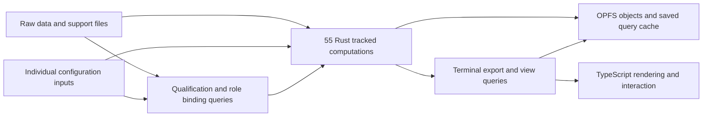

# 55-step incremental Rust execution plan

Status: active. The current browser product runs the complete preprocessing
pipeline in Rust/WASM, but it does **not** yet cache and execute the 55 declared
transformations independently.

This file is the single implementation plan and durable work log for that
change. The machine-readable step graph remains
`.semantic-federation/semantic/resources/chronicle.plan.json`; this document
records why the change is needed, how it will be built, and what must pass
before the app is called production-ready.

## Goal in one sentence

Make each of the 55 Rust transformations a tracked, cached computation whose
actual reads determine invalidation, so a changed raw file, support file, or
configuration value reruns exactly the necessary transformations and every
warm result is checked against the complete Rust pipeline.

## Current truth

Four different things exist today and must not be confused:

1. `PIPELINE_STEPS` declares 55 transformation identities and their intended
   dependencies.
2. `chronicle.plan.json` groups those steps into 15 reporting checkpoints.
3. `FusedPhysicalExecutor::ensure_result()` calls
   `run_pipeline_v2_with_supports()` once to compute the whole pipeline after
   any physical cache miss.
4. `build_runtime_step_executions()` calculates 55 input keys and status labels
   **after** the fused result exists. Those labels describe what the declared
   graph says should have changed; they do not prove that only those Rust step
   bodies ran.

Therefore the current state is:

| Question | Current answer |
|---|---|
| Is browser preprocessing primarily Rust/WASM? | Yes. |
| Are all 55 transformations named in Rust? | Yes. |
| Are their intended data/config/support dependencies recorded? | Yes. |
| Are there 55 separately callable Rust implementations? | No. |
| Can one changed middle option skip all unaffected physical work? | No. Any physical miss invokes the full pipeline. |
| Does a warm unchanged request reuse the prior complete result in one worker? | Yes. |
| Does that warm cache survive reload or worker replacement? | No. The stored files survive, but computation is repeated. |
| Do current `cached`/`recomputed` step labels equal actual function execution events? | No. They are a post-run projection. |

This distinction is the main production blocker addressed by this plan.

## Why this matters to the preprocessing app

The app has raw Chronicle CSV data, optional support files, and many
researcher-controlled options. A small change can have one of several effects:

- no computational effect at all;
- change which input satisfies a required role;
- change qualification without changing the input file's identity;
- change an early transformation and most later outputs;
- change a middle transformation and a narrower downstream set;
- change only final output assembly or a view.

The product must answer two questions correctly every time:

1. What result should this exact set of data, files, and options produce?
2. Which existing intermediate results are still valid?

The first question is already answered by the complete fused Rust pipeline.
The second is not yet answered by physical execution. The target runtime must
answer both without introducing a second ontology or another graph that copies
the existing 55-step contract.

## What is kept

The following work is valid and remains part of the product:

- exact profile versions, resource hashes, licenses, and offline verification;
- product-owned role qualification and explicit missing/ambiguous inputs;
- the Rust 55-step contract and 15 grouped views;
- existing synthetic generators, golden cases, combinatorial cases, controlled
  one-setting changes, source-file changes, and semantic-model mutation tests;
- the fused Rust pipeline as the cold correctness oracle and temporary rollback;
- OPFS content-addressed storage, append-only journal records, Arrow lineage,
  result-cell correspondence, registered queries, and typed browser views;
- TypeScript limited to worker transport, browser I/O, interaction, and
  rendering.

The shared profile registry, toolchain, and template remain free of Chronicle's
execution code. They provide exact dependency packaging, validation, generated
adapters, and checks; the product owns the incremental computation model.

## What changes

The final runtime will have one Rust function or tracked query for each declared
step. A query may return an immutable typed value directly or a lightweight
hash/handle to bytes stored once in the existing content-addressed store.

Rules:

- A query reads only the upstream results, configuration inputs, and source
  roles it actually needs.
- A query must not receive the complete options object as a convenient hidden
  dependency.
- The runtime records actual query execution events. It does not infer them
  afterward from changed hashes.
- If a changed input is read but produces the same derived value, downstream
  work stops at that point.
- If the declared plan and observed query dependencies differ, the check fails.
- Unknown inputs, unknown required profile rules, missing bindings, and cache
  version mismatches fail closed or discard the cache and run cold.
- Stored query state is only a cache. Source files, options, product contract,
  implementation identity, and stored result objects remain authoritative.

## Existing software decision

Salsa is the first product trial because its tracked queries record actual
input reads, memoize results, report execution events, and implement red-green
validation/early cutoff. The shared toolchain's toy native/WASM probe passed,
but Chronicle never performed the required product trial before the custom
scheduler was selected.

The trial uses a pinned Salsa release with default features disabled and only
the features required by the product. The browser build does not assume Rayon
or shared-memory WASM threads. Native parallel execution is considered only
after exact invalidation is correct.

Salsa is accepted only if the real Chronicle trial proves:

- native and `wasm32-unknown-unknown` builds;
- tracked configuration, raw-data, support-file, qualification, and binding
  dependencies;
- actual execution events for unchanged, upstream, middle, downstream, and
  binding changes;
- early cutoff when a recomputed value is unchanged;
- no hidden thread, `Send`, network, or persistence requirement in the browser;
- cache snapshot rejection after implementation, contract, or schema changes;
- no unexplained result, state, lineage, or invalidation difference from the
  fused Rust oracle;
- acceptable memory and WASM size on the large existing fixture.

If it fails one of those checks, Chronicle keeps the same 55-query design and
implements the smallest product-owned memo table needed to satisfy the same
tests. `depends` and `incremental-query` are not fallback candidates: the first
describes itself as a proof of concept and the second currently requires an
unstable Rust feature. `comemo` is useful prior art for tracking actual reads,
not a complete replacement for the product query runtime.

## The exact 55 transformations

The order and edges below come from the current Rust contract. All 55 are
currently recorded inside the fused pipeline; none is yet an independently
memoized product query. A row becomes complete only when the named step has a
callable Rust query, a typed result, exact input reads, a fused-oracle parity
test, and an actual-execution invalidation test.

| # | Step | Current group | Direct upstream steps |
|---:|---|---|---|
| 1 | `parse_remap_config` | `parse_events` | — |
| 2 | `csv_parse` | `parse_events` | — |
| 3 | `drop_empty_timestamp` | `parse_events` | `csv_parse` |
| 4 | `detect_device_model` | `parse_events` | `drop_empty_timestamp` |
| 5 | `resolve_preproc_datetime` | `parse_events` | — |
| 6 | `build_canonical_rows` | `parse_events` | `drop_empty_timestamp`, `resolve_preproc_datetime`, `detect_device_model`, `parse_remap_config` |
| 7 | `stable_sort` | `parse_events` | `build_canonical_rows` |
| 8 | `collect_timezones` | `parse_events` | `stable_sort` |
| 9 | `compute_dominant_timezone` | `normalize_timezones` | `stable_sort` |
| 10 | `select_timezone_strategy` | `normalize_timezones` | `stable_sort`, `compute_dominant_timezone` |
| 11 | `restamp_rows` | `normalize_timezones` | `select_timezone_strategy` |
| 12 | `row_count_report` | `normalize_timezones` | `select_timezone_strategy`, `restamp_rows` |
| 13 | `exact_dedupe` | `dedup_and_order` | `restamp_rows` |
| 14 | `count_dup_groups` | `dedup_and_order` | `exact_dedupe` |
| 15 | `nudge_duplicate_timestamps` | `dedup_and_order` | `exact_dedupe` |
| 16 | `mark_data_time_gaps` | `dedup_and_order` | `nudge_duplicate_timestamps` |
| 17 | `tag_filtered_packages` | `app_policy` | `mark_data_time_gaps` |
| 18 | `collect_keyguard_timestamps` | `device_state_timeline` | `tag_filtered_packages` |
| 19 | `walk_screen_state_machine` | `device_state_timeline` | `tag_filtered_packages` |
| 20 | `build_classified_sessions` | `device_state_timeline` | `tag_filtered_packages`, `walk_screen_state_machine`, `collect_keyguard_timestamps` |
| 21 | `compute_junk_packages` | `reconstruct_episodes` | `tag_filtered_packages` |
| 22 | `junk_blind_fold` | `reconstruct_episodes` | `tag_filtered_packages`, `compute_junk_packages` |
| 23 | `build_matcher_input` | `reconstruct_episodes` | `junk_blind_fold` |
| 24 | `run_matcher` | `reconstruct_episodes` | `build_matcher_input` |
| 25 | `apply_matcher_output` | `reconstruct_episodes` | `junk_blind_fold`, `run_matcher`, `compute_junk_packages` |
| 26 | `relabel_usage_with_floor` | `reconstruct_episodes` | `apply_matcher_output` |
| 27 | `junk_downstream_mark` | `reconstruct_episodes` | `relabel_usage_with_floor`, `compute_junk_packages` |
| 28 | `sort_episodes` | `reconstruct_episodes` | `junk_downstream_mark` |
| 29 | `split_concurrent` | `reconstruct_episodes` | `sort_episodes` |
| 30 | `codebook_join` | `categorize_apps` | `split_concurrent` |
| 31 | `derive_broad_category` | `categorize_apps` | `codebook_join` |
| 32 | `collapse_genre` | `categorize_apps` | `derive_broad_category` |
| 33 | `engagement_walk` | `episode_annotations` | `collapse_genre` |
| 34 | `flag_and_retain` | `episode_annotations` | `engagement_walk` |
| 35 | `blank_junk_timing` | `interval_cleaning` | `flag_and_retain` |
| 36 | `drop_selected_types` | `interval_cleaning` | `blank_junk_timing` |
| 37 | `drop_zero_duration` | `interval_cleaning` | `drop_selected_types` |
| 38 | `partition_credit_sessions` | `effective_usage` | `drop_zero_duration` |
| 39 | `build_liveness_substrate` | `effective_usage` | `tag_filtered_packages` |
| 40 | `report_screen_incapable` | `effective_usage` | `partition_credit_sessions`, `build_liveness_substrate` |
| 41 | `count_day_apps` | `effective_usage` | `partition_credit_sessions` |
| 42 | `credit_sessions` | `effective_usage` | `partition_credit_sessions`, `build_liveness_substrate`, `count_day_apps` |
| 43 | `emit_credited_rows` | `effective_usage` | `credit_sessions` |
| 44 | `assemble_credit_result` | `effective_usage` | `partition_credit_sessions`, `report_screen_incapable`, `emit_credited_rows` |
| 45 | `resolve_participant_windows` | `observation_window` | `drop_zero_duration` |
| 46 | `filter_rows_to_window` | `observation_window` | `drop_zero_duration`, `resolve_participant_windows` |
| 47 | `resolve_sharing_status` | `attribute_person` | `filter_rows_to_window` |
| 48 | `build_survey_lookup` | `attribute_person` | — |
| 49 | `attribute_rows` | `attribute_person` | `filter_rows_to_window`, `resolve_sharing_status`, `build_survey_lookup` |
| 50 | `inject_placeholders` | `day_coverage` | `attribute_rows`, `tag_filtered_packages` |
| 51 | `build_raw_date_index` | `day_coverage` | `tag_filtered_packages` |
| 52 | `build_coverage_table` | `day_coverage` | `inject_placeholders`, `build_raw_date_index` |
| 53 | `accumulate_attribution_minutes` | `score_compliance` | `inject_placeholders` |
| 54 | `score_days` | `score_compliance` | `accumulate_attribution_minutes`, `attribute_rows` |
| 55 | `assemble_result` | `outputs` | `tag_filtered_packages`, `inject_placeholders`, `build_coverage_table`, `build_classified_sessions`, `assemble_credit_result`, `filter_rows_to_window`, `attribute_rows`, `score_days` |

The exact configuration and source-role reads remain in
`rust/chronicle_chrono_kernel_wasm/src/step_contract.rs`. During extraction they
become tracked accessor calls, and a build check compares observed reads with
that declared documentation. The observed reads decide runtime invalidation;
the declared contract supports review, visualization, mutation, and drift
detection.

## Authority and data ownership

| Concern | Owner after completion | Meaning |
|---|---|---|
| What a file or option means | Existing semantic profile and Chronicle qualification code | Validates and assigns product inputs without executing preprocessing. |
| What depends on what at runtime | Chronicle's 55 tracked Rust queries | Dependency edges come from actual reads. |
| Correct complete output | Existing fused Rust pipeline during migration; then cold execution of the same 55 queries | Independent comparison remains until the new path is proven. |
| Intermediate and output bytes | Existing content-addressed store and OPFS adapter | Large values are stored once; query results may use typed handles. |
| What actually ran | Query-runtime execution events | Replaces post-run inferred step statuses. |
| Why an input qualified or a step reran | Existing journal/provenance types fed by real qualification and query events | Explanations report facts from execution. |
| Graph, status, result, and explanation panels | Existing typed Rust views rendered by TypeScript | Views are derived and may be regenerated. |

## Acceptance checks

The goal is complete only when all of these are true:

1. Exactly 55 step IDs exist in the Rust contract, product plan, callable query
   registry, execution-event registry, and verification report.
2. Every step ID resolves to one Rust function/query. Grouping a step under one
   of the 15 views is not accepted as an implementation binding.
3. Every raw-data field, support file, option, qualification result, and binding
   result read by computation enters through a tracked input or tracked query.
4. A build/test check fails when a query reads an untracked option or source,
   when the declared and observed dependency graphs differ, or when a step is
   missing or duplicated.
5. Cold 55-query execution matches the current fused Rust oracle for every
   existing golden, synthetic, combinatorial, boundary, and adversarial case.
6. Warm execution matches an independent cold execution for every tested input
   change and random sequence of changes.
7. The actual query execution event set equals the expected dirty set in both
   directions: no needed query is skipped and no unrelated query body runs.
8. The existing one-factor, pair, triple, source-file, boundary, and mixed
   source/configuration campaigns run against the physical query executor, not
   post-run status labels.
9. Qualification and binding changes invalidate the exact affected queries,
   including cases where candidate file identity stays constant but a setting
   changes what qualifies.
10. Unchanged derived values stop downstream execution while keeping outputs
    identical.
11. Terminal CSV, Parquet, SPSS, aggregates, lineage, correspondence,
    provenance, index input, and typed views are separate queries and are not
    regenerated when unchanged.
12. A saved query cache survives browser reload where supported. A corrupt,
    incompatible, partial, or stale cache is discarded safely and the cold
    result remains correct.
13. Native Rust and browser WASM produce identical result bytes, hashes, query
    states, execution events, qualification outcomes, and invalidation sets.
14. TypeScript contains no preprocessing, scheduling, cache-key, qualification,
    provenance-authority, or semantic-state logic.
15. The current complete local gate remains green. No existing correctness,
    security, coverage, mutation, bundle, or offline requirement is weakened.
16. Only the preview site may be deployed during development. Production Pages,
    `main`, research-pipeline, homelab deployment, and runner infrastructure
    remain untouched.

## Performance requirements

Correct skipping is the first optimization. Parallelism and SIMD come after the
event log proves that the right work is running.

All measurements use the existing 60,624-row fixture and record process wall
time, time inside `execute_workspace`, peak resident memory, artifact bytes,
WASM size, query execution events, and output hashes.

| Case | Required physical behavior | Initial acceptance target |
|---|---|---|
| Cold execution | All applicable step queries run and match the fused oracle. | No more than 10% slower than the current fused `execute_workspace` baseline before later tuning. |
| No change | No step body and no unchanged terminal artifact/view query runs. | At most 10% of cold wall time. |
| Raw input change | Only queries that read the changed parsed content and their changed descendants run. | Event-set correctness is mandatory; time is reported, not guessed. |
| Early option change | The exact early path runs; downstream stops wherever output values are unchanged. | Event-set correctness is mandatory. |
| Middle option change | Only its reader queries and changed descendants run. | Materially faster than cold on an activating fixture. |
| Output-only change such as `study_name` | Only result/output metadata and dependent views run. | At most 25% of cold wall time. |
| Binding/qualification change | Re-evaluate qualification and only affected consumers. | No unrelated preprocessing query executes. |
| Cache reload | Restore verified compatible query state or explicitly run cold. | Never report a cached step that physically ran. |

The current large-fixture baseline is about 8.37 seconds inside
`execute_workspace`, 945 MiB maximum process RSS, 143 MB of produced artifacts,
and a 4.76 MB runtime WASM module. The first product spike must not exceed the
current memory baseline and should keep additional compressed WASM below the
previous 1 MiB scheduler budget. A measured exception requires a concrete
benefit and an updated budget; it cannot be hidden in an aggregate bundle.

Browser shared-memory threads are not assumed because the current GitHub Pages
preview does not provide the cross-origin isolation headers required by WASM
threads. BLAKE3 already uses SIMD. Native Rayon and additional data-parallel
kernels may be added after the query boundaries are correct and profiles show
remaining CPU work that can run independently.

## Work plan

### Phase 0 — truthful baseline and setup

- Record exact branch, commit, worktree, fused executor, 55-step contract,
  current performance, and existing test results.
- Correct every document that equates logical status projection with physical
  step execution.
- Generate a machine-readable current/target status with these counts:
  55 declared steps, 15 reporting groups, 1 fused physical executor, and 0
  independently cached step bodies.
- Add a deterministic check that fails on stale branch names, incorrect counts,
  or claims that the current fused runtime already performs minimal physical
  recomputation.
- Keep this file as the single live backlog and decision record.

Proof: document check, behavior-inventory drift check, semantic contract check,
and clean generated diff.

### Phase 1 — real Salsa product trial

- Add Salsa in a sibling Chronicle trial crate with default features disabled,
  so an unselected dependency cannot change the production runtime identity.
- Model one raw input, individual configuration accessors, one support file,
  one qualification result, and a representative early/middle/output path.
- Return typed values or content-addressed handles using existing Chronicle
  types; do not add a generic federation value type.
- Record actual query events and compare them with the current expected sets.
- Build and run natively and in browser WASM.
- Test optional persistence using the existing alternating-root OPFS commit
  path; reject incompatible snapshots.
- Measure code size, memory, cold time, and warm time.
- Accept Salsa or record the exact failed condition and implement the bounded
  product memo table against the same tests.

Proof: `cargo test`, native/WASM checks, browser execution test, event log,
parity report, persistence fault test, and benchmark report.

### Phase 2 — tracked product inputs and qualification

- Represent raw bytes, each support file, and each cache-relevant configuration
  value as independent tracked inputs/accessors.
- Track role requirements, candidate qualification, selected assignment,
  ambiguity, absence, and not-applicable outcomes.
- Prove that changing a setting can change a requirement or assignment without
  changing candidate identity.
- Remove whole-options-object access from query bodies and add a lint/check that
  prevents it from returning.
- Keep labels/view-only settings outside computational invalidation unless a
  terminal view query reads them.

Proof: exact read-set tests, binding tests, negative/missing-file tests,
qualification mutation tests, and declared-versus-observed dependency check.

### Phase 3 — extract all 55 transformations

- Extract the existing `pipeline_v2.rs` logic without changing behavior.
- Work in topological groups, but finish with 55 independently callable query
  bindings rather than 15 physical functions.
- Reuse existing domain structs and helpers. Introduce a new type only when a
  step has a real intermediate value that is not currently named.
- Add fused-oracle parity and exact event-set tests after each coherent group.
- Keep the fused entry point calling its existing logic until the new path has
  complete parity; do not maintain two independently edited algorithms.
- Generate the callable registry from the Rust step contract and fail the build
  for a missing, duplicate, unreachable, cyclic, or mistyped binding.

Proof: 55/55 registry, group-level parity, complete cold parity, query-event
coverage, and no duplicated algorithm implementation.

### Phase 4 — real intermediate and terminal caching

- Store large immutable intermediate values once and pass typed handles when a
  direct value would cause large copies.
- Make exports, aggregates, lineage, source/result correspondence, semantic
  index input, provenance, and each typed view independent terminal queries.
- Persist compatible query state using the existing OPFS root commit only after
  a successful persistence trial.
- Bind saved state to implementation, build environment, product contract,
  profile lock, and serialization version.
- On any mismatch or corruption, discard the cache and run cold.
- Add retention and garbage-collection rules for query-cache objects without
  changing the authoritative source/result object rules.

Proof: no-change event log, reload reuse, crash at every commit point, corrupt
snapshot recovery, garbage collection, and output equality.

### Phase 5 — connect execution facts to provenance and views

- Replace post-run `build_runtime_step_executions()` status inference with
  actual query events.
- Keep plan edges as declared/reviewable documentation and compare them with
  observed reads.
- Record why each query executed, reused a value, stopped propagation, failed,
  skipped, or was not applicable.
- Make graph/status/explanation panels render the actual events and saved root.
- Keep exact source coordinates and result-cell coordinates distinct from
  dependency claims; add exact contribution detail only where the algorithm can
  prove it.

Proof: explanation tests, actual-event/view parity, lineage joins, registered
query tests, and UI E2E for upstream/middle/downstream/binding changes.

### Phase 6 — cutover and cleanup

- Shadow the query runtime against the fused oracle over all existing test
  campaigns.
- Classify and fix every difference; do not approve unexplained differences.
- Switch the browser worker to the query runtime only after all acceptance
  checks pass.
- Keep one release-bounded cold-oracle fallback, then remove it after the
  acceptance period.
- Remove the custom 15-node scheduler if Salsa is accepted.
- Remove post-run step-cache/status inference.
- Replace capability bindings that map 55 step IDs to 15 enum values with the
  generated callable query registry.
- Move the dependency report to build/test evidence; it must not decide runtime
  reuse after actual-read tracking exists.
- Delete stale docs and correct historical claims without rewriting Git
  history.

Proof: legacy modules unavailable in the production build, exact authority
searches, all gates green, preview-only deploy, rollback rehearsal, and final
review.

### Phase 7 — production-ready proof

- Run the complete existing local gate plus the new physical-incrementality
  matrix.
- Finish remaining core Rust coverage and mutation work that affects the 55
  query path.
- Run Chromium, Firefox, and WebKit capability tests or explicitly limit the
  supported browser set with a fail-closed check and user-visible message.
- Run large-file browser memory and OPFS crash tests.
- Profile cold and every warm mutation class with Hyperfine, browser CPU/heap
  profiles, and native flamegraphs.
- Run the final review on code, tests, generated files, docs, and benchmark
  evidence.
- Build and deploy only the preview artifact.

Proof: signed-off test matrix below, generated production report, clean local
gate, exact preview byte hash, and no production/main changes.

## Detailed backlog

Statuses are `done`, `active`, `pending`, or `blocked`. A `done` item needs a
named command or file proving it.

| Item | Status | Proof or next action |
|---|---|---|
| Create one durable goal for real 55-step execution | done | Active Codex goal created 2026-07-23. |
| Verify canonical Chronicle worktree and shared toolchain | done | Canonical preflight passed; Chronicle branch `codex/chronicle-55-step-authority` at `d7271fdd`. |
| Record the fused-versus-55-step mismatch | done | Generated inventory and `check-execution-claims.py` report 55 declared / 0 independently cached / one fused executor. |
| Correct README and production claims | done | Product semantic check and local four-part review passed 2026-07-23. |
| Correct shared Salsa decision history | done | Toolchain decision updated; dependency probe and `make check` passed. |
| Create reproducible representative warm-mutation benchmark | done | `measure_trial` and `docs/perf/SALSA_PRODUCT_TRIAL.md` cover cold, unchanged, raw, middle, output, and binding cases on the 60,624-row fixture. |
| Add Salsa Chronicle trial and dependency smoke | done | Pinned `0.28.1`; native test/clippy, `wasm32` check, headless-Chrome test, audit, and deny policy pass. |
| Implement representative query path | done | Six real product queries have body/`WillExecute` parity and controlled-change tests. |
| Decide Salsa versus bounded memo table | pending | Product trial report against all mandatory conditions. |
| Track every computational input separately | pending | Read-set and forbidden-whole-options checks. |
| Track qualification and assignments | pending | Same-candidate/config-change regression. |
| Extract steps 1–16 | pending | Fused parity and exact event tests. |
| Extract steps 17–32 | pending | Fused parity and exact event tests. |
| Extract steps 33–44 | pending | Fused parity and exact event tests. |
| Extract steps 45–55 | pending | Fused parity and exact event tests. |
| Generate 55 callable bindings | pending | Registry test reports 55 unique callable queries. |
| Cache typed intermediates without large copies | pending | Allocation/memory profile and identity tests. |
| Split terminal outputs and derived views into queries | pending | No-change and output-only event tests. |
| Persist compatible query state | pending | Reload/crash/corruption matrix. |
| Replace inferred statuses with real events | pending | Runtime and view contract tests. |
| Run all existing empirical campaigns on physical events | pending | Updated ledgers with cold parity and actual event sets. |
| Enforce TypeScript boundary | pending | Architecture checks and production bundle search. |
| Remove superseded scheduler/status code | pending | Dead-code/dependency checks after cutover. |
| Meet coverage and mutation requirements | pending | Rust coverage and mutation reports. |
| Meet performance requirements | pending | Hyperfine/flamegraph/browser profile report. |
| Complete browser durability decision | pending | Cross-browser tests or explicit supported-browser restriction. |
| Run subphase reviews and fixes | pending | Review record after each phase. |
| Run final aggregate review | pending | Final findings all fixed or rejected with evidence. |
| Deploy preview only | pending | Preview commit and byte-hash verification. |

## Test obligation matrix

| Component | Must add | Must run | Health check | Boundary check | Advanced proof | Status |
|---|---|---|---|---|---|---|
| Documentation/current-state check | Count/state/forbidden-claim cases and a seeded false claim | semantic federation check | checker prints 55 declared / 0 independent / fused | Generated current state must match source symbols | check must fail on a seeded contradiction | done |
| Salsa product trial | early/middle/output/binding query tests | native and WASM Cargo checks | real Chronicle calls in native and headless Chrome | no default Rayon/thread/network requirement | event log, early cutoff, persistence corruption, size/memory benchmark | active; representative checks pass, complete 55-query checks remain |
| Tracked inputs | every option/source/qualification accessor | Rust unit and contract tests | construct database from one complete fixture | unknown and untracked reads fail | property and mutation tests over access sets | pending |
| 55 query registry | missing/duplicate/cycle/type cases | registry and build drift checks | resolve and call every applicable query | exactly 55 callable bindings | semantic-model mutation of every edge and binding | pending |
| Step extraction | nearest behavior tests per group | existing Rust/golden suites | cold run on smallest fixture | malformed/empty/boundary inputs | fused parity, fuzz, property, mutation | pending |
| Incremental execution | unchanged/upstream/middle/downstream/binding changes | all controlled-change campaigns | warm call after cold call | both under-invalidation and over-invalidation fail | random sequences, inverse, commutativity, early cutoff | pending |
| Query persistence | save/reload/version/corruption cases | OPFS integration and browser E2E | reload one workspace offline | partial writes, wrong digest/build/schema | crash injection at every commit point | pending |
| Provenance and explanations | real event/reason mapping | journal, index, registered-query tests | request stage and explanation views | no inferred cached/recomputed status | replay and root equality | pending |
| Terminal results/views | independent output and view query tests | native/WASM and browser tests | render complete result offline | no unchanged artifact regeneration | exact bytes, lineage/correspondence parity | pending |
| TypeScript boundary | forbidden import/symbol cases | typecheck, static checks, production build | worker starts and processes through Rust | no TS computation or semantic authority | make legacy modules unavailable in E2E | pending |
| Performance | committed benchmark cases and thresholds | Hyperfine, browser profile, native flamegraph | benchmark fixture hash and output hash | fail on false cached claim | repeated distributions, memory, bundle size | pending |
| Security/supply chain | malformed cache/profile/artifact cases | cargo audit/deny, Semgrep, ast-grep, Trivy, gitleaks | offline execution | profiles cannot inject code; cache cannot bypass verification | fuzz parsers and import paths | pending |
| Release/rollback | query-runtime and cold-oracle switches | complete `make all` plus new gates | preview loads offline | no production/main/research-pipeline changes | rollback rehearsal and preview hash | pending |

Not applicable to this work: server database migration, multi-user HTTP load,
Kubernetes/container deployment, mobile-device automation, GPU/HIL tests, and
runner provisioning. The product is a local browser/WASM application and those
systems are explicitly outside this goal.

## Research and decision record

| Question | Evidence | Decision |
|---|---|---|
| Should the shared semantic toolchain execute product graphs? | Registry/toolchain/template boundaries and prior cross-repo review | No. Chronicle owns its queries. |
| Is the current 15-node scheduler sufficient? | `FusedPhysicalExecutor` and `build_runtime_step_executions()` source | No. It caches fingerprints and status projections, not intermediate computation. |
| Is the existing 55-step contract useful? | Rust step IDs, topology, config/source bindings, and empirical tests | Yes. Keep it and bind it to real queries. |
| Should the declared graph or observed reads control invalidation? | Stale-result risk and existing TypeScript Proxy read-tracing precedent | Observed tracked reads control execution; the declared graph is checked against them. |
| Why try Salsa? | Shared native/WASM probe, actual-read tracking, events, memoization, early cutoff, current persistence feature | It is the first bounded product trial, not a global standard. |
| Why keep the fused pipeline? | Existing verified Rust behavior and goldens | Cold oracle and temporary rollback only. |
| Should all intermediate tables become RDF? | Existing local-first design and tabular scale | No. Keep bytes/tables in typed Rust values and content-addressed storage; RDF remains a derived index. |
| Should parallelism be the first optimization? | Current warm runs still do the full pipeline and rebuild large outputs | No. Eliminate unnecessary work first, then profile and parallelize remaining independent hot paths. |

Research already completed and retained:

- standards and ontology comparison in the semantic federation documents;
- exact profile/toolchain/template repositories and current boundaries;
- Salsa, Oxigraph, and Grafeo native/WASM dependency probes;
- official Salsa repository/docs and current feature verification;
- alternatives including `comemo`, `incremental-rs`, `depends`, and
  `incremental-query`;
- full external review archive at
  `/Users/u/.local/share/layer8/review-results/cross-repo-semantic-federation-full-review-20260721-v2--88b2c99f59d7f050.md`.

The missing research step was not another library search. It was running the
already-approved incremental-query trial in the actual Chronicle workload.

## Risks and fail-safe behavior

| Risk | Required response |
|---|---|
| A query omits a real input read | Declared-versus-observed check and controlled-change tests fail; cold parity remains mandatory. |
| A declared edge is too broad | Actual events expose over-execution; optimize only after output correctness. |
| A derived value changes representation but not meaning | Define and test the step's equality rule; otherwise use exact equality and recompute conservatively. |
| Large query values copy too much data | Store immutable buffers once and return typed handles; profile allocations. |
| Salsa changes API or fails WASM/persistence needs | Pin exactly and use the bounded product memo fallback with the same tests. |
| Saved cache is corrupt or built by different code | Reject it and run cold. Never weaken source/result verification. |
| Fused and query results differ | Keep fused authority, record the smallest failing fixture, and fix before proceeding. |
| Event labels claim work was skipped when it ran | Treat as a release-blocking correctness failure. |
| Preview host cannot run WASM threads | Keep single-threaded browser query execution; do not require cross-origin isolation. |

No user decision currently blocks execution. The reversible default is to run
the Salsa product trial behind a feature, keep the fused path authoritative,
and make no production deployment change.

## Live control state

- Current hypothesis: actual-read tracking plus cached typed intermediates will
  reuse far more work than the current 15-checkpoint fingerprint scheduler
  without requiring a new ontology or generic runtime.
- Last evidence: source inspection shows every physical miss calls
  `run_pipeline_v2_with_supports()` and all 55 status keys are built afterward;
  the shared Salsa native/WASM probe passes but no Chronicle product trial
  exists.
- Local Rust setup: `/opt/homebrew/bin/cargo` uses the Homebrew compiler, which
  does not see rustup-installed targets. WASM checks therefore use
  `rustup run stable cargo ... --target wasm32-unknown-unknown`; a plain
  `cargo ... --target wasm32-unknown-unknown` failure on this workstation is a
  toolchain-path mismatch, not a product failure.
- Next proof: make the current/target state machine-checkable, rerun the shared
  dependency probe, then implement a representative Chronicle Salsa path and
  compare its actual event log with the fused oracle.
- Main risk: extracting query boundaries could duplicate algorithm logic rather
  than reusing the existing Rust helpers. Every extraction review must check
  for one implementation of each transformation.
- Status: active.

## Completion record for the user's request

| Requested result | Status | Evidence |
|---|---|---|
| Put the corrected understanding in the plan | done | This document names the 55 steps, current truth, target, phases, checks, and live backlog. |
| Put it in the tracked goal | done | Active Codex goal created 2026-07-23. |
| Correct all accessible project documents | done | README, decisions, proof, review, inventory, baseline, branch authority, shared dependency decision, and central handoff were updated and checked. |
| Use the software already researched | active | Salsa product trial is mandatory; shared protocol remains unchanged. |
| Do not invent another abstract runtime | done | Existing 55-step contract and Rust functions are the only product model; the status check adds no runtime behavior. |
| Make the setup generalized but prove it in this app | active | Shared repositories keep narrow reusable responsibilities; Chronicle owns the first full implementation. |
| Make it production-ready | pending | Phases 1–7 and every acceptance check must pass. |
| Keep TypeScript to interaction/rendering | pending verification | Existing boundary remains; final cutover checks enforce it. |
| Commit/push and preview-only deploy | pending | Per the earlier instruction, after verified implementation milestones; no production/main change. |

## Required review record

Every phase ends with four checks: reuse of existing code, code quality,
efficiency, and silent-failure/error handling. Findings are fixed or rejected
with exact evidence, then the phase's tests run again. A final review covers the
entire change and test matrix before preview deployment.

### Phase 0 review — 2026-07-23

- Reuse: the setup uses the existing behavior-inventory generator,
  `.semantic-federation` check target, 55-step contract, fused oracle, and shared
  dependency probe. It adds no second graph or runtime.
- Quality: the first draft placed current/target status fields inside the
  digest-bound executable plan. Targeted Rust tests showed that this invalidated
  every empirical receipt even though computation had not changed. The fields
  were moved to the derived behavior inventory and this document; the executable
  plan and its hashes were restored byte-for-byte.
- Efficiency: a duplicated 55-ID status list and a misleading partial
  `fused_rust_physical_stage_nodes` list were removed. The inventory now points
  one post-run status summary at the single declared step list.
- Silent failure: `check-execution-claims.py` fails on forbidden completion
  wording, wrong counts, missing step IDs, a changed fused source shape, or a
  premature callable-query binding. Its self-test and the product semantic check
  both pass.
- Verification: shared dependency probes passed; shared toolchain `make check`
  passed; Chronicle semantic checks passed; semantic adapter tests passed 37/37;
  product runtime tests passed 47/47; native and browser-WASM checks passed; JSON,
  Python syntax, diff whitespace, and generated-file checks passed.

This plan is not evidence that the runtime is finished. The production claim
changes only when the machine-readable current-state counts show 55 callable
and independently cached Rust queries and all acceptance checks above pass.
