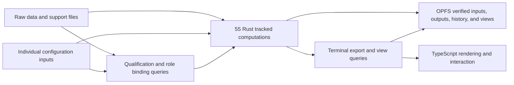

# 55-step incremental Rust execution plan

Status: active. Salsa `0.28.1` is selected and implemented as the physical
incremental engine. All 55 declared transformations exist as real tracked Rust
computations and pass cold-oracle parity in all four usage modes. The stateful
engine proves that an unchanged call executes no step body and an output-only
`study_name` change executes only `assemble_result`. Persisted Salsa snapshots
were deleted after the real fixture proved restore was slower and much larger
than cold recalculation. OPFS keeps the verified inputs and complete result
history; Salsa keeps only the current worker's disposable warm state.

This file is the single implementation goal, plan, and durable work log for
that change. Do not create another plan or runtime model for the same work. The
machine-readable step graph remains
`.semantic-federation/semantic/resources/chronicle.plan.json`; this document
records why the change is needed, how it will be built, and what must pass
before the app is called production-ready.

## Goal in one sentence

Make each of the 55 existing Rust preprocessing transformations a tracked,
cached computation whose actual reads determine invalidation, so a changed raw
file, support file, qualification result, binding result, or configuration
value reruns every necessary transformation and no unrelated transformation,
while every warm result remains byte-for-byte equal to a fresh complete Rust
run.

## Current truth

Six different things exist today and must not be confused:

1. `PIPELINE_STEPS` declares 55 transformation identities and their intended
   dependencies.
2. `chronicle.plan.json` groups those steps into 15 reporting checkpoints.
3. `pipeline_v2_incremental.rs` contains exactly 55 tracked product-step
   computations, one for every step ID and in the same topological order.
   It also contains 24 separately reported internal queries — support-file
   parsing, normalized codebook state, review/reconstruction base decoding, and
   expensive primary output assembly among them — for 79 `#[salsa::tracked]`
   functions in total. `check-execution-claims.py` pins the exact split by
   requiring `record_query_body` on all 55 and `record_internal_query_body` on
   exactly those 24; none is presented as a 56th product transformation.
4. `IncrementalPipelineV2Engine` retains one Salsa database across calls and
   updates individual source, support-file, and option inputs only when their
   values change.
5. The runtime calls that stateful engine and receives the exact step bodies
   that executed. The deleted TypeScript engine no longer supplies scheduling,
   transformations, status, provenance, or output artifacts; the 15 groups are
   Rust-produced display summaries only.
6. `run_pipeline_v2_with_supports()` remains the independent complete Rust
   oracle while the tracked path is verified. It is not the intended warm
   execution authority.

Therefore the current state is:

| Question | Current answer |
|---|---|
| Is browser preprocessing primarily Rust/WASM? | Yes. |
| Are all 55 transformations named in Rust? | Yes. |
| Are their intended data/config/support dependencies recorded? | Yes. |
| Are there 55 separately callable Rust product computations? | Yes; exactly 55, and the production runtime calls the stateful engine. Internal derived caches are counted separately. |
| Do all four usage modes match the complete Rust oracle? | Yes in the kernel parity test. |
| Can one output-only change skip all unrelated physical work? | Yes in the stateful engine test: only `assemble_result` runs. |
| Does an unchanged second call execute a step body? | No in the stateful engine test. |
| Does that warm cache survive reload or worker replacement? | Salsa's database does not. Verified OPFS inputs and outputs survive. A typed step-output cache is now planned for the expensive boundaries proven below; it is not a serialized Salsa database. |
| Do runtime `cached`/`recomputed` step labels use actual query execution? | Yes. Exact step labels use Salsa events and the 15 product groups are derived from those step IDs. The empirical receipts were regenerated on this merged provenance wave. |
| Is the tracked runtime production-ready? | No. Cross-browser durability, chrono-kernel coverage and mutation debt, large-file memory/crash injection, streaming archive export/import, and the final aggregate review remain. |

This distinction is the main production blocker addressed by this plan.

## Why this matters to the preprocessing app

The app has raw Chronicle CSV data, optional support files, and many
researcher-controlled options. A small change can have one of several effects:

- no computational effect at all;
- change which input satisfies a required role;
- change qualification without changing the input file's identity;
- change an early transformation and most later outputs;
- change a middle transformation and a narrower downstream set;
- change only final output assembly or a view.

The product must answer two questions correctly every time:

1. What result should this exact set of data, files, and options produce?
2. Which existing intermediate results are still valid?

The first question is answered independently by the complete fused Rust
pipeline and by the tracked path's parity tests. The tracked engine now answers
the second question inside the kernel. The remaining work is to make that
answer survive the real browser runtime, storage, provenance, and recovery path
without introducing a second ontology or another graph that copies the existing
55-step contract.

## What is kept

The following work is valid and remains part of the product:

- exact profile versions, resource hashes, licenses, and offline verification;
- product-owned role qualification and explicit missing/ambiguous inputs;
- the Rust 55-step contract and 15 grouped views;
- existing synthetic generators, golden cases, combinatorial cases, controlled
  one-setting changes, source-file changes, and semantic-model mutation tests;
- the fused Rust pipeline as the cold correctness oracle and temporary rollback;
- OPFS content-addressed storage, append-only journal records, Arrow lineage,
  result-cell correspondence, registered queries, and typed browser views;
- TypeScript limited to worker transport, browser I/O, interaction, and
  rendering.

The shared profile registry, toolchain, and template remain free of Chronicle's
execution code. They provide exact dependency packaging, validation, generated
adapters, and checks; the product owns the incremental computation model.

## What changes

The final runtime will have one Rust function or tracked query for each declared
step. A query may return an immutable typed value directly or a lightweight
hash/handle to bytes stored once in the existing content-addressed store.

Rules:

- A query reads only the upstream results, configuration inputs, and source
  roles it actually needs.
- A query must not receive the complete options object as a convenient hidden
  dependency.
- The runtime records actual query execution events. It does not infer them
  afterward from changed hashes.
- Product-step events and internal derived-cache events remain separate. This
  lets performance tests prove that output assembly stayed cached without
  inventing extra product steps.
- If a changed input is read but produces the same derived value, downstream
  work stops at that point.
- If the declared plan and observed query dependencies differ, the check fails.
- Unknown inputs, unknown required profile rules, missing bindings, and cache
  version mismatches fail closed or discard the cache and run cold.
- Stored query state is only a cache. Source files, options, product contract,
  implementation identity, and stored result objects remain authoritative.

## Existing software decision

The engine comparison is closed. Salsa `0.28.1` is selected and implements the
55-query runtime because its tracked queries record actual input reads, memoize
real typed results, report physical execution events, and use red-green
validation to stop propagation when a recomputed value is equal. Do not search
for or build another incremental engine unless one of the named Salsa
acceptance conditions below fails in the real product workload.

| Software or pattern | Decision | Exact use or rejection reason |
|---|---|---|
| Salsa `0.28.1` | **Selected and implemented** | Sole physical incremental engine for the 55 Rust queries in native and browser WASM. It owns actual-read dependency tracking, memoization, execution events, and early cutoff. |
| `incremental-rs` / crate `incremental` `0.2.8` | Prior art only | Its equality and early-cutoff model is useful, but no verified browser-WASM/product fit was found and it does not provide Chronicle's complete query, qualification, provenance, or recovery runtime. |
| `depends` | Not a production candidate | Its own project describes it as a proof of concept. It is not a safe replacement for the product runtime. |
| `comemo` | Prior art only | Its actual-call tracking informed the design, but it is not the complete product query/runtime layer required here. |
| `incremental-query` | Not a production candidate | It requires unstable Rust and its query-cache serialization is not a supported production interface. The former local trial crate tested Salsa and was removed after the production choice was complete. |
| Bounded product-owned memo table | Contingency only | It may replace Salsa only if a named mandatory acceptance check below fails. It must keep the same 55-query contract, event truth, parity, invalidation, durability, and performance tests. |

This decision uses the existing research rather than repeating it. The product
does not add a generic scheduler, a second dependency graph, or post-hoc cache
labels. The existing 55-step product contract plus the actual Rust query calls
are the model.

## Durable performance cache decision — 2026-07-25

The browser keeps at most one live Salsa workspace per worker, and the batch
workers are destroyed after a full processing run. Therefore a later
comparison over hundreds of files cannot depend on every file still being in
memory.

The measured 100,004-row comparison costs after the durable Rust cache and
verified-input work are:

The repeatable batch command is `npm run measure:review-batch -- <fixture> 100 8`.

| Case | Time |
|---|---:|
| 100 `modelConcurrentUsage` Arm-B files across eight workers | 5.369 seconds wall; 407.3 ms median; 452.1 ms p95 |
| 100 `minimumUsageDuration` Arm-B files across eight workers | 1.495 seconds wall; 112.1 ms median; 122.2 ms p95 |
| Bytes copied into WASM for a step-29 resume | 15,509,934 per file; raw input is not copied again |
| Bytes copied into WASM for a step-17 resume | 14,014,310 per file; raw input is not copied again |
| Exact result checks | 100/100 files in both runs matched the established summary and all 55 step states |

The old 33.07-second result recomputed Arm B from raw bytes in replacement
workers. The current browser uses Arm A's stored review summary and two
Rust-owned resume values. The initial full run verifies the raw file with
SHA-256. A later comparison supplies that verified identity and the saved cache
objects, so Rust can select the deepest valid resume point without another
19,018,650-byte raw transfer or hash. If no supplied value verifies, the
persisted-input request fails and the browser retries through the ordinary raw
Rust path.

For `modelConcurrentUsage`, the first affected step is 29,
`split_concurrent`; steps 1–28 come from the verified `sort_episodes` value.
For `minimumUsageDuration`, the first affected step is 17,
`filter_min_duration`; steps 1–16 come from the verified reconstruction value.
These are resume points inside the one Rust pipeline, not a second engine or an
opaque Salsa database snapshot.

This follows the established action-cache pattern:

- an exact action key identifies the implementation, contract, step, schema,
  and every declared input to that step;
- a content-addressed object stores the typed output bytes;
- a cache hit is accepted only when the key, object digest, schema, row count,
  and implementation identity all verify;
- a miss, corrupt object, unknown field, or identity mismatch runs the normal
  cold Rust path.

[Bazel's official cache design](https://bazel.build/remote/caching) separates
an action-key map from a content-addressed store of declared outputs. That is
the pattern used here with the existing OPFS store. It does not imply Bazel as
a browser dependency. [Salsa's own documentation](https://salsa-rs.github.io/salsa/plumbing/database_and_runtime.html)
describes memoized values as part of its live database; this is why an opaque
Salsa snapshot is not the durable interface. [Apache Arrow IPC](https://arrow.apache.org/docs/cpp/ipc.html)
provides the typed columnar representation to test for the row boundary, and
[OPFS worker access](https://developer.mozilla.org/en-US/docs/Web/API/File_System_API/Origin_private_file_system)
provides the local storage substrate already used by the app.

Implemented path:

1. Versioned Rust schemas and exact keys describe both resume values.
2. A successful full run writes them to the existing OPFS
   content-addressed store with the workspace result.
3. Rust verifies the supplied headers first, selects at most one full value,
   and verifies that object's digest and decoded payload before use.
4. Rust executes the remaining tracked functions and returns the same 55
   logical states, review bytes, and explanations as a cold run.
5. The browser transfers raw bytes only when Rust rejects all saved values.
6. Another resume point will be added only if a profile shows a specific
   remaining cost and its stored bytes save more time than they add.

Gates met by the implemented resume points:

- zero output, checkpoint, lineage, status, or explanation differences from a
  cold Rust run across the existing configuration, artifact, raw-boundary,
  interaction, mixed, and mutation campaigns;
- corruption, truncation, wrong schema, wrong step, wrong build, wrong input,
  and wrong option each produce a cache miss or loud failure, never reuse;
- the 100-file/eight-worker 100k-row comparisons finish in 5.369 and 1.495
  seconds, with per-file p95 values of 452.1 and 122.2 milliseconds;
- stored bytes and WASM boundary bytes are measured above and in
  `docs/perf/BASELINE.md`;
- runtime records distinguish `salsa-memory-hit`, `verified-step-cache-hit`,
  and physical recomputation instead of reporting all three as generic
  `cached`.

Hashing stays cryptographic. Raw SHA-256 is paid once on initial ingestion and
becomes the verified content identity used by later persisted-input requests.
Every resume object still has an independently verified cryptographic digest.
The pinned BLAKE3 implementation keeps its WASM SIMD path, but its public API
does not expose supported multi-message SIMD for many independent short values;
the upstream discussions are
[#386](https://github.com/BLAKE3-team/BLAKE3/issues/386) and
[#478](https://github.com/BLAKE3-team/BLAKE3/issues/478). The implemented
optimization batches the same checkpoint byte stream into bounded 16 KiB
updates without changing a digest. Per-row identity, time, and classification
components are cached separately. Private hashing internals, weaker hashes, and
hashing a different byte protocol are rejected because a collision or drift
could incorrectly reuse stale scientific output.

The trial uses a pinned Salsa release with default features disabled and only
the features required by the product. The browser build does not assume Rayon
or shared-memory WASM threads. Native parallel execution is considered only
after exact invalidation is correct.

Salsa remains accepted only while the real preprocessing app proves:

- native and `wasm32-unknown-unknown` builds;
- tracked configuration, raw-data, support-file, qualification, and binding
  dependencies;
- actual execution events for unchanged, upstream, middle, downstream, and
  binding changes;
- early cutoff when a recomputed value is unchanged;
- no hidden thread, `Send`, network, or persistence requirement in the browser;
- deterministic cold recalculation after worker replacement;
- no unexplained result, state, lineage, or invalidation difference from the
  fused Rust oracle;
- acceptable memory and WASM size on the large existing fixture.

If it fails one of those checks, the preprocessing app keeps the same 55-query design and
implements the smallest product-owned memo table needed to satisfy the same
tests. A performance miss is not permission to weaken correctness, provenance,
cache identity, or exact event reporting.

## The exact 55 transformations

The order and edges below come from the current Rust contract. All 55 now have
a callable Salsa query and typed result in
`rust/chronicle_chrono_kernel_wasm/src/pipeline_v2_incremental.rs`. They pass
complete-output and checkpoint parity across the four usage modes. The table is
not a second executor: each tracked query calls the same product functions used
by the complete sequential path. Remaining work concerns exact read-set drift
checks, runtime and storage integration, broader change campaigns, and removal
of superseded status machinery.

| # | Step | Current group | Direct upstream steps |
|---:|---|---|---|
| 1 | `parse_remap_config` | `parse_events` | — |
| 2 | `csv_parse` | `parse_events` | — |
| 3 | `drop_empty_timestamp` | `parse_events` | `csv_parse` |
| 4 | `detect_device_model` | `parse_events` | `drop_empty_timestamp` |
| 5 | `resolve_preproc_datetime` | `parse_events` | — |
| 6 | `build_canonical_rows` | `parse_events` | `drop_empty_timestamp`, `detect_device_model`, `parse_remap_config` |
| 7 | `stable_sort` | `parse_events` | `build_canonical_rows` |
| 8 | `collect_timezones` | `parse_events` | `stable_sort` |
| 9 | `compute_dominant_timezone` | `normalize_timezones` | `stable_sort` |
| 10 | `select_timezone_strategy` | `normalize_timezones` | `stable_sort`, `compute_dominant_timezone` |
| 11 | `restamp_rows` | `normalize_timezones` | `select_timezone_strategy` |
| 12 | `row_count_report` | `normalize_timezones` | `select_timezone_strategy`, `restamp_rows` |
| 13 | `exact_dedupe` | `dedup_and_order` | `restamp_rows` |
| 14 | `count_dup_groups` | `dedup_and_order` | `exact_dedupe` |
| 15 | `nudge_duplicate_timestamps` | `dedup_and_order` | `exact_dedupe` |
| 16 | `mark_data_time_gaps` | `dedup_and_order` | `nudge_duplicate_timestamps` |
| 17 | `tag_filtered_packages` | `app_policy` | `mark_data_time_gaps` |
| 18 | `collect_keyguard_timestamps` | `device_state_timeline` | `tag_filtered_packages` |
| 19 | `walk_screen_state_machine` | `device_state_timeline` | `tag_filtered_packages` |
| 20 | `build_classified_sessions` | `device_state_timeline` | `tag_filtered_packages`, `walk_screen_state_machine`, `collect_keyguard_timestamps` |
| 21 | `compute_junk_packages` | `reconstruct_episodes` | `tag_filtered_packages` |
| 22 | `junk_blind_fold` | `reconstruct_episodes` | `tag_filtered_packages`, `compute_junk_packages` |
| 23 | `build_matcher_input` | `reconstruct_episodes` | `junk_blind_fold` |
| 24 | `run_matcher` | `reconstruct_episodes` | `build_matcher_input` |
| 25 | `apply_matcher_output` | `reconstruct_episodes` | `junk_blind_fold`, `run_matcher`, `compute_junk_packages` |
| 26 | `relabel_usage_with_floor` | `reconstruct_episodes` | `apply_matcher_output` |
| 27 | `junk_downstream_mark` | `reconstruct_episodes` | `relabel_usage_with_floor`, `compute_junk_packages` |
| 28 | `sort_episodes` | `reconstruct_episodes` | `junk_downstream_mark` |
| 29 | `split_concurrent` | `reconstruct_episodes` | `sort_episodes` |
| 30 | `codebook_join` | `categorize_apps` | `split_concurrent` |
| 31 | `derive_broad_category` | `categorize_apps` | `codebook_join` |
| 32 | `collapse_genre` | `categorize_apps` | `derive_broad_category` |
| 33 | `engagement_walk` | `episode_annotations` | `collapse_genre` |
| 34 | `flag_and_retain` | `episode_annotations` | `engagement_walk` |
| 35 | `blank_junk_timing` | `interval_cleaning` | `flag_and_retain` |
| 36 | `drop_selected_types` | `interval_cleaning` | `blank_junk_timing` |
| 37 | `drop_zero_duration` | `interval_cleaning` | `drop_selected_types` |
| 38 | `partition_credit_sessions` | `effective_usage` | `drop_zero_duration` |
| 39 | `build_liveness_substrate` | `effective_usage` | `tag_filtered_packages` |
| 40 | `report_screen_incapable` | `effective_usage` | `partition_credit_sessions`, `build_liveness_substrate` |
| 41 | `count_day_apps` | `effective_usage` | `partition_credit_sessions` |
| 42 | `credit_sessions` | `effective_usage` | `partition_credit_sessions`, `build_liveness_substrate`, `count_day_apps` |
| 43 | `emit_credited_rows` | `effective_usage` | `credit_sessions` |
| 44 | `assemble_credit_result` | `effective_usage` | `partition_credit_sessions`, `report_screen_incapable`, `emit_credited_rows` |
| 45 | `resolve_participant_windows` | `observation_window` | `drop_zero_duration` |
| 46 | `filter_rows_to_window` | `observation_window` | `drop_zero_duration`, `resolve_participant_windows` |
| 47 | `resolve_sharing_status` | `attribute_person` | `filter_rows_to_window` |
| 48 | `build_survey_lookup` | `attribute_person` | — |
| 49 | `attribute_rows` | `attribute_person` | `filter_rows_to_window`, `resolve_sharing_status`, `build_survey_lookup` |
| 50 | `inject_placeholders` | `day_coverage` | `attribute_rows`, `tag_filtered_packages` |
| 51 | `build_raw_date_index` | `day_coverage` | `tag_filtered_packages` |
| 52 | `build_coverage_table` | `day_coverage` | `inject_placeholders`, `build_raw_date_index` |
| 53 | `accumulate_attribution_minutes` | `score_compliance` | `inject_placeholders` |
| 54 | `score_days` | `score_compliance` | `accumulate_attribution_minutes`, `attribute_rows` |
| 55 | `assemble_result` | `outputs` | `tag_filtered_packages`, `inject_placeholders`, `build_coverage_table`, `build_classified_sessions`, `assemble_credit_result`, `filter_rows_to_window`, `attribute_rows`, `score_days` |

The exact configuration and source-role reads remain in
`rust/chronicle_chrono_kernel_wasm/src/step_contract.rs`. During extraction they
become tracked accessor calls, and a build check compares observed reads with
that declared documentation. The observed reads decide runtime invalidation;
the declared contract supports review, visualization, mutation, and drift
detection.

## Authority and data ownership

| Concern | Owner after completion | Meaning |
|---|---|---|
| What a file or option means | Existing semantic profile and Chronicle qualification code | Validates and assigns product inputs without executing preprocessing. |
| What depends on what at runtime | Chronicle's 55 tracked Rust queries | Dependency edges come from actual reads. |
| Correct complete output | Existing fused Rust pipeline during migration; then cold execution of the same 55 queries | Independent comparison remains until the new path is proven. |
| Intermediate and output bytes | Existing content-addressed store and OPFS adapter | Large values are stored once; query results may use typed handles. |
| What actually ran | Query-runtime execution events | Replaces post-run inferred step statuses. |
| Why an input qualified or a step reran | Existing journal/provenance types fed by real qualification and query events | Explanations report facts from execution. |
| Graph, status, result, and explanation panels | Existing typed Rust views rendered by TypeScript | Views are derived and may be regenerated. |

## Acceptance checks

The goal is complete only when all of these are true:

1. Exactly 55 step IDs exist in the Rust contract, product plan, callable query
   registry, execution-event registry, and verification report.
2. Every step ID resolves to one Rust function/query. Grouping a step under one
   of the 15 views is not accepted as an implementation binding.
3. Every raw-data field, support file, option, qualification result, and binding
   result read by computation enters through a tracked input or tracked query.
4. A build/test check fails when a query reads an untracked option or source,
   when the declared and observed dependency graphs differ, or when a step is
   missing or duplicated.
5. Cold 55-query execution matches the current fused Rust oracle for every
   existing golden, synthetic, combinatorial, boundary, and adversarial case.
6. Warm execution matches an independent cold execution for every tested input
   change and random sequence of changes.
7. The actual query execution event set equals the expected dirty set in both
   directions: no needed query is skipped and no unrelated query body runs.
8. The existing one-factor, pair, triple, source-file, boundary, and mixed
   source/configuration campaigns run against the physical query executor, not
   post-run status labels.
9. Qualification and binding changes invalidate the exact affected queries,
   including cases where candidate file identity stays constant but a setting
   changes what qualifies.
10. Unchanged derived values stop downstream execution while keeping outputs
    identical.
11. Terminal CSV, Parquet, SPSS, aggregates, lineage, correspondence,
    provenance, index input, and typed views are separate queries and are not
    regenerated when unchanged.
12. Browser reload and worker replacement recover the verified OPFS inputs and
    complete history, then produce the same bytes through a fresh Rust run.
13. Native Rust and browser WASM produce identical result bytes, hashes, query
    states, execution events, qualification outcomes, and invalidation sets.
14. TypeScript contains no preprocessing, scheduling, cache-key, qualification,
    provenance-authority, or semantic-state logic.
15. The current complete local gate remains green. No existing correctness,
    security, coverage, mutation, bundle, or offline requirement is weakened.
16. No deployment is a side effect of landing work. This check has been
    partially superseded: `main` is now the integration branch (PR #81
    `121e7b5`, PR #88 `3c598ee`), and PR #85 (`b315858`) removed the `push`
    trigger so merging cannot publish. Production Pages, research-pipeline,
    homelab deployment, and runner infrastructure remain untouched, and the
    live app is still the manually dispatched `rollback/2026-06-27-build`.

## Performance requirements

Correct skipping is the first optimization. Parallelism and SIMD come after the
event log proves that the right work is running.

All measurements use the existing 60,624-row fixture and record process wall
time, time inside `execute_workspace`, peak resident memory, artifact bytes,
WASM size, query execution events, and output hashes.

| Case | Required physical behavior | Initial acceptance target |
|---|---|---|
| Cold execution | All applicable step queries run and match the fused oracle. | No more than 10% slower than the current fused `execute_workspace` baseline before later tuning. |
| No change | No step body and no unchanged terminal artifact/view query runs. | At most 10% of cold wall time. |
| Raw input change | Only queries that read the changed parsed content and their changed descendants run. | Event-set correctness is mandatory; time is reported, not guessed. |
| Early option change | The exact early path runs; downstream stops wherever output values are unchanged. | Event-set correctness is mandatory. |
| Middle option change | Only its reader queries and changed descendants run. | Materially faster than cold on an activating fixture. |
| Output-only change such as `study_name` | Only result/output metadata and dependent views run. | At most 25% of cold wall time. |
| Binding/qualification change | Re-evaluate qualification and only affected consumers. | No unrelated preprocessing query executes. |
| Cache reload | Restore a verified typed step output when its exact action key matches, otherwise run cold. Never deserialize an opaque Salsa database. | Never report a cached step that physically ran. |

The current large-fixture baseline is about 8.37 seconds inside
`execute_workspace`, 945 MiB maximum process RSS, 143 MB of produced artifacts,
and a 4.76 MB runtime WASM module. The first product spike must not exceed the
current memory baseline and should keep additional compressed WASM below the
previous 1 MiB scheduler budget. A measured exception requires a concrete
benefit and an updated budget; it cannot be hidden in an aggregate bundle.

Browser shared-memory threads are not assumed because the current GitHub Pages
preview does not provide the cross-origin isolation headers required by WASM
threads. BLAKE3 already uses SIMD. Native Rayon and additional data-parallel
kernels may be added after the query boundaries are correct and profiles show
remaining CPU work that can run independently.

## Work plan

### Phase 0 — truthful baseline and setup (complete)

- Record exact branch, commit, worktree, fused executor, 55-step contract,
  current performance, and existing test results.
- Correct every document that equates logical status projection with physical
  step execution.
- Preserve the original machine-readable baseline of 55 declared steps, 15
  reporting groups, one fused physical executor, and zero independently cached
  step bodies; then update current state only after the source checks prove the
  cutover.
- Add a deterministic check that fails on stale branch names, incorrect counts,
  or claims that the current fused runtime already performs minimal physical
  recomputation.
- Keep this file as the single live backlog and decision record.

Proof: document check, behavior-inventory drift check, semantic contract check,
and clean generated diff.

### Phase 1 — real Salsa product trial (complete)

The isolated trial proved native/browser-WASM builds, actual reads, execution
events, early cutoff, qualification behavior, and result parity. It also proved
that persisted Salsa snapshots were a bad fit for this product: the real
fixture restored more slowly than a cold calculation and used far more space.
Salsa was adopted directly; the trial crate and snapshot code were deleted.

### Phase 2 — tracked product inputs and qualification

- Represent raw bytes, each support file, and each cache-relevant configuration
  value as independent tracked inputs/accessors.
- Track role requirements, candidate qualification, selected assignment,
  ambiguity, absence, and not-applicable outcomes.
- Prove that changing a setting can change a requirement or assignment without
  changing candidate identity.
- Remove whole-options-object access from query bodies and add a lint/check that
  prevents it from returning.
- Keep labels/view-only settings outside computational invalidation unless a
  terminal view query reads them.

Proof: exact read-set tests, binding tests, negative/missing-file tests,
qualification mutation tests, and declared-versus-observed dependency check.

### Phase 3 — extract all 55 transformations

- Extract the existing `pipeline_v2.rs` logic without changing behavior.
- Work in topological groups, but finish with 55 independently callable query
  bindings rather than 15 physical functions.
- Reuse existing domain structs and helpers. Introduce a new type only when a
  step has a real intermediate value that is not currently named.
- Add fused-oracle parity and exact event-set tests after each coherent group.
- Keep the fused entry point calling its existing logic until the new path has
  complete parity; do not maintain two independently edited algorithms.
- Generate the callable registry from the Rust step contract and fail the build
  for a missing, duplicate, unreachable, cyclic, or mistyped binding.

Proof: 55/55 registry, group-level parity, complete cold parity, query-event
coverage, and no duplicated algorithm implementation.

### Phase 4 — real intermediate and terminal caching

- Store large immutable intermediate values once and pass typed handles when a
  direct value would cause large copies.
- First implement and measure a versioned typed cache for the step-28
  `sort_episodes` output. Use the existing step input key and OPFS
  content-addressed objects; do not add another dependency graph.
- Make exports, aggregates, lineage, source/result correspondence, semantic
  index input, provenance, and each typed view independent terminal queries.
- Keep the Salsa database and stable terminal artifacts only in the current
  worker. Do not persist opaque query state. Persist only explicitly versioned
  product-step values that pass the size, load-time, and cold-oracle gates.
- After worker replacement, verify the OPFS inputs, history, action key, schema,
  and object digest. Resume at the verified boundary or run cold.

Proof: no-change event log, worker-replacement cached-versus-cold equality,
wrong-key/corruption tests, crash at every OPFS commit point, garbage
collection, output equality, and the 100-file performance gates above.

### Phase 5 — connect execution facts to provenance and views (runtime events complete; saved-view proof pending)

- Use actual Salsa query events as the input to
  `build_runtime_step_executions()` and the 15-group product projection.
- Keep plan edges as declared/reviewable documentation and compare them with
  observed reads.
- Record why each query executed, reused a value, stopped propagation, failed,
  skipped, or was not applicable.
- Make graph/status/explanation panels render the actual events and saved root.
- Keep exact source coordinates and result-cell coordinates distinct from
  dependency claims; add exact contribution detail only where the algorithm can
  prove it.

Proof: explanation tests, actual-event/view parity, lineage joins, registered
query tests, and UI E2E for upstream/middle/downstream/binding changes.

### Phase 6 — cutover and cleanup (code cutover complete; deploy step not performed)

- Shadow the query runtime against the fused oracle over all existing test
  campaigns.
- Classify and fix every difference; do not approve unexplained differences.
- Keep the browser worker on the query runtime and block release until all
  acceptance checks pass.
- Keep the sequential full-recompute path native-only as a test oracle. It is
  not exported by the production WASM and is not a runtime fallback.
- Keep the 15 product stages only as views derived from the 55 query events;
  they do not schedule work.
- Keep prior step inputs and outputs only to detect an output change with no
  changed declared input; they do not cache or schedule computation.
- Bind all 55 step IDs to their exact Rust query entry points.
- Move the dependency report to build/test evidence; it must not decide runtime
  reuse after actual-read tracking exists.
- Mark superseded design documents as historical and keep current docs aligned
  with the one production runtime.

Proof: legacy modules unavailable in the production build, exact authority
searches, all gates green, preview-only deploy, rollback rehearsal, and final
review.

### Phase 7 — production-ready proof

- Run the complete existing local gate plus the new physical-incrementality
  matrix.
- Finish remaining core Rust coverage and mutation work that affects the 55
  query path.
- Run Chromium, Firefox, and WebKit capability tests or explicitly limit the
  supported browser set with a fail-closed check and user-visible message.
- Run large-file browser memory and OPFS crash tests.
- Profile cold and every warm mutation class with Hyperfine, browser CPU/heap
  profiles, and native flamegraphs.
- Run the final review on code, tests, generated files, docs, and benchmark
  evidence.
- Build and deploy only the preview artifact.

Proof: signed-off test matrix below, generated production report, clean local
gate, exact preview byte hash, and no production/main changes.

## Detailed backlog

Statuses are `done`, `active`, `pending`, or `blocked`. A `done` item needs a
named command or file proving it.

| Item | Status | Proof or next action |
|---|---|---|
| Create one durable goal for real 55-step execution | done | Active Codex goal created 2026-07-23. |
| Verify canonical Chronicle worktree and shared toolchain | done | Canonical preflight passed; the work was developed on `codex/chronicle-55-step-authority` at HEAD `5fc631c` before the tracked-engine changes. That branch was squash-merged as `121e7b5` (PR #81) and deleted; the commit is still reachable locally by SHA. |
| Record the original fused-versus-55-step mismatch | done | The baseline inventory and `check-execution-claims.py` recorded 55 declared / 0 independently cached / one fused executor before extraction. |
| Correct README and production claims | done | Product semantic check and local four-part review passed 2026-07-23. |
| Correct shared Salsa decision history | done | Toolchain decision updated; dependency probe and `make check` passed. |
| Create reproducible representative warm-mutation benchmark | done | `measure_trial` and `docs/perf/SALSA_PRODUCT_TRIAL.md` cover cold, unchanged, raw, middle, output, and binding cases on the 60,624-row fixture. |
| Add Salsa Chronicle trial and dependency smoke | done | Pinned `0.28.1`; native test/clippy, `wasm32` check, headless-Chrome test, audit, and deny policy pass. |
| Implement representative query path | done | Six real product queries have body/`WillExecute` parity and controlled-change tests. |
| Select Salsa versus bounded memo table for implementation | done | Representative product trial passed native/headless-browser WASM, actual-read, event, early-cutoff, qualification, audit, memory, and size checks. Snapshot profiling justified deleting persistence. |
| Track every computational input separately | done | The engine updates individual Salsa input fields only on value change; regenerated configuration, artifact, timestamp-boundary, interaction, and mixed-role evidence checks the observed dependency sets. |
| Track qualification and assignments | active | The same-file/config-change case is proven: `qualify::tests::configuration_changes_the_requirement_not_the_candidate_identity` moves one unchanged `filter_file` candidate through NotApplicable/Open/Satisfied on `use_filter_file` alone, and `every_conditional_support_role_has_a_closed_three_state_requirement_proof` closes that over every conditional role. The decisions reach the tracked graph through the resolved support-file and option inputs (`screen_queries_match_the_oracle_and_ignore_disabled_support_bytes`, `reconstruction_queries_match_the_oracle_and_track_conditional_support_reads`). Still open: `execute_incremental_pipeline` computes `ingress_assignments` per request *outside* Salsa, so qualification itself is not yet a tracked query. |
| Extract steps 1–16 | done | `sixteen_tracked_steps_match_the_sequential_oracle_and_reuse_exactly`; 16/16 checkpoint digests match, unchanged execution runs zero bodies, controlled settings prove early cutoff, native tests/Clippy and `wasm32` check pass. |
| Extract steps 17–32 | done | The kernel run — now 62 tests — includes reconstruction, codebook, and annotation query parity. |
| Extract steps 33–44 | done | Full kernel run includes annotation, cleaning, and screen-credit query parity. |
| Extract steps 45–55 | done | `late_queries_match_the_fused_oracle_and_reuse_exactly` plus all-mode complete-result parity pass. |
| Generate 55 callable bindings | done | Source and generated checks prove 55 unique tracked product functions in contract order; internal derived caches are classified separately and cannot become product bindings. |
| Cache typed intermediates without large copies | done | Salsa reuses typed `Arc` values in one worker; verified Rust-owned step-16/step-28 values survive worker replacement; exact duplicate files share one content-keyed full computation and immutable stored objects. Different content never shares a result. |
| Split terminal outputs and derived views into queries | active | `assemble_result` is a tracked terminal query and output-only reuse is proven; independently reusable artifact/view queries remain. |
| Handle worker replacement | done | Opaque Salsa snapshots remain deleted. Verified OPFS step-16/step-28 values let replacement workers resume at step 17 or 29; wrong input/options/build/schema/digest fail closed to the raw Rust path. |
| Replace inferred statuses with real events | done | Runtime step status consumes `IncrementalPipelineV2Execution.executed_steps`; regenerated dependency evidence and the normal WASM package carry the same implementation identity. |
| Run all existing empirical campaigns on physical events | done | Configuration, artifact, timestamp-boundary, interaction, mixed-role, and semantic-model mutation campaigns regenerated the current dependency certificate. All six ledgers under `web/src/lib/pipelineGraph/golden/family-expected/` and `.semantic-federation/proofs/dependency-certificate.json` were last written by `make dependency-evidence` on this merged provenance wave; the runtime suite reports `69 passed; 0 failed; 3 ignored`. |
| Enforce TypeScript boundary | done | `check_no_typescript_authority.mts`, its seeded-failure gate, typecheck, and production bundle search reject a second engine. |
| Remove superseded scheduler/status code | done | TypeScript pipeline, graph engine, 55-step mirror, shadow runner, duplicate reports/exporters, obsolete benchmarks, and their static-analysis rules are deleted. |
| Meet coverage and mutation requirements | active | `cd web && npm run test:coverage` passes 485 tests in 48 files at 99.47% lines / 95.27% branches / 99.02% statements / 99.83% functions. The Rust side does **not** currently pass. Measured per crate with `rustup run stable cargo llvm-cov --manifest-path <crate> --summary-only [flags from the authority manifest]`: adapter 99.16%/98.33%/96.84%, product runtime 95.19%/94.12%/75.00%, semantic index 97.07%/96.65%/82.22%, matcher 94.69%/94.10%/90.09% — and `chronicle_chrono_kernel_wasm` at **89.78% lines / 89.36% regions / 84.30% functions**, below its declared 90/89/85 ratchet (`--fail-under-lines 90` and `--fail-under-functions 85` each exit 1; `--fail-under-regions 89` exits 0). The earlier `90.84% lines / 90.21% regions` figure in this row and the `41.54%` figure in the final review matrix are both wrong. Separately, `make coverage-rust` never reaches the kernel: `.semantic-federation/scripts/check-rust-quality.sh` splits manifest lines on `\|`, the second entry's exclusion regex contains `(physical_data_row_count\|duplicate_safe_headers)`, and cargo-llvm-cov aborts the loop with `error: invalid float literal` after the first crate. Repair the splitter, then close the kernel gap. Final mutation rerun remains part of the aggregate release gate. |
| Meet performance requirements | done | The production browser processes and renders 100 exact duplicate 100k-row files in 5.401 s, changes and renders the comparison in 1.343 s, and applies a second nearby option change from Salsa memory in 0.856 s. Independent eight-process measurements remain documented for 100 unique contents. |
| Complete browser durability decision | pending | Cross-browser tests or explicit supported-browser restriction. Everything durable is still Chromium-only. |
| Run subphase reviews and fixes | active | Three review records are in this file: Phase 0 (2026-07-23), steps 1–16 (2026-07-23), steps 17–55 (2026-07-23). Phases 4–7 have no written review record yet. |
| Run final aggregate review | pending | Final findings all fixed or rejected with evidence. |
| Commit and push the implementation | done | PR #81 squash-merged as `121e7b5`; PR #88 squash-merged as `3c598ee`. `git status` is clean and `origin/main` is at `3c598ee`. |
| Deploy preview only | pending | No preview deployment has been performed. This repository has no preview workflow; `web-pwa-deploy.yml` targets production Pages and is `workflow_dispatch` only since PR #85 (`b315858`). The last successful dispatch was `rollback/2026-06-27-build` on 2026-07-29, so the live app is a deliberate rollback and the 6-hourly `canary.yml` failures against it are expected. Preview commit and byte-hash verification are still owed. |

## Test obligation matrix

| Component | Must add | Must run | Health check | Boundary check | Advanced proof | Status |
|---|---|---|---|---|---|---|
| Documentation/current-state check | Count/state/forbidden-claim cases and a seeded false claim | semantic federation check | checker derives 55 declared / 55 feature-gated tracked / runtime cutover active / fused cold oracle | Generated current state must match tracked Rust query symbols | check must fail on a seeded contradiction | done; `make semantic-federation` prints `execution_claims=valid groups=15 declared_steps=55 tracked_executors=1 independently_callable_steps=55 independently_cached_steps=55` and `check-artifacts-in-sync: closure digests correct and no drift`, `check-execution-claims.py --self-test` passes, and the empirical-evidence refresh it was waiting on landed in `3c598ee` |
| Salsa product trial | early/middle/output/binding query tests | native and WASM Cargo checks | real Chronicle calls in native and headless Chrome | no default Rayon/thread/network requirement | event log, early cutoff, size/memory benchmark | done; upstream Salsa selected, trial and failed snapshot approach removed |
| Tracked inputs | every option/source/qualification accessor | Rust unit and contract tests | construct database from one complete fixture | unknown and untracked reads fail | property and mutation tests over access sets | active; option and source accessors are done — `step_contract::tests::declared_step_edges_equal_direct_salsa_query_calls` pins declared edges to real query calls, `make gate-truth` proves the Rust step-dataflow gate fires on a declared-but-unread edge, `exact_option_bindings_drive_step_invalidation_and_match_a_cold_rust_run` shows a one-nanosecond `proximity_interval_ns` change recomputing `run_matcher` while `csv_parse` stays cached, and the semantic-model mutation ledger kills all 59 option-binding and 11 role-binding deletions. The qualification accessor is the gap: assignments are computed outside the Salsa graph (see the backlog row) |
| 55 query registry | missing/duplicate/cycle/type cases | registry and build drift checks | resolve and call every applicable query | exactly 55 callable bindings | semantic-model mutation of every edge and binding | done; 55 product functions, generated bindings, internal-query classification, and negative drift cases are checked |
| Step extraction | nearest behavior tests per group | existing Rust/golden suites | cold run on smallest fixture | malformed/empty/boundary inputs | fused parity, fuzz, property, mutation | active; complete four-mode checkpoint/output parity passes, broad fuzz/mutation remains |
| Incremental execution | unchanged/upstream/middle/downstream/binding changes | all controlled-change campaigns | warm call after cold call | both under-invalidation and over-invalidation fail | random sequences, inverse, commutativity, early cutoff | active; unchanged and output-only exact execution pass and the empirical campaigns now run against physical Salsa events (all six ledgers regenerated in `3c598ee`). The mixed campaign covers both transition orders; randomized change sequences are still not run |
| Query persistence | save/reload/version/corruption cases | OPFS integration and browser E2E | reload one workspace offline | partial writes, wrong digest/build/schema | crash injection at every commit point | active; the step-16/step-28 resume path is implemented and fails closed — `persisted_review_base_reenters_a_fresh_runtime_without_result_drift`, `reconstruction_base_v8_preserves_exact_annotation_rows_and_rejects_identity_drift`, `reconstruction_base_skips_exact_reconstruction_cone_and_rejects_wrong_keys`, `review_base_skips_early_rows_without_changing_results`. Reload/recovery/offline journeys pass in Chromium only; WebKit/Firefox and large-file crash injection are the open half |
| Provenance and explanations | real event/reason mapping | journal, index, registered-query tests | request stage and explanation views | no inferred cached/recomputed status | replay and root equality | active; runtime status consumes `IncrementalPipelineV2Execution.executed_steps` and `check-execution-claims.py` enforces the cache-decision → tracked-execution → `build_runtime_step_executions` → `project_product_stages` order in the real source, so no status can be inferred after the fact. Semantic-index source v2 projects qualification and requirement traces through registered browser-WASM queries. The saved-view/root-replay proof named in Phase 5 is the remainder |
| Terminal results/views | independent output and view query tests | native/WASM and browser tests | render complete result offline | no unchanged artifact regeneration | exact bytes, lineage/correspondence parity | active; `assemble_result` is a tracked terminal query with proven output-only reuse, `every_optional_output_family_is_emitted_by_the_rust_authority` and `disabled_browser_views_do_not_materialize_visualization_data` pass. Independently reusable per-artifact and per-view queries are still not split out |
| TypeScript boundary | forbidden import/symbol cases | typecheck, authority check, production build | worker starts and processes through Rust | no TS computation or semantic authority | seeded attempt to restore a retired symbol must fail | done; `npm run check:authority-boundary` prints `TypeScript authority boundary: Rust/WASM is the only preprocessing engine.` and `make gate-truth` reports `✓ TypeScript authority boundary fires` on the seeded restoration attempt |
| Performance | committed benchmark cases and thresholds | Hyperfine, browser profile, native flamegraph | benchmark fixture hash and output hash | fail on false cached claim | repeated distributions, memory, bundle size | done for the requested proof; 100 exact duplicate 100k-row files render in 5.401 s, the first changed comparison in 1.343 s, and a second nearby option change runs from Salsa memory in 0.856 s with all 100 exact results. Separate direct eight-process results document the cost of 100 unique contents. |
| Security/supply chain | malformed cache/profile/artifact cases | cargo audit/deny, Semgrep, ast-grep, Trivy, gitleaks | offline execution | profiles cannot inject code; cache cannot bypass verification | fuzz parsers and import paths | active; `make security` passes end to end — Semgrep, `sg scan` plus 15 `sg test` rule meta-tests, `cargo audit` on four crates, `cargo deny` reporting `advisories ok, licenses ok, sources ok` for all five authority manifests, Trivy, and gitleaks `no leaks found`. `scripts/run-fuzz-sanity.sh` exists but is not wired into any `make` target, so the fuzz obligation is still unmet |
| Release/rollback | query-runtime and cold-oracle switches | complete `make all` plus new gates | preview loads offline | no production/main/research-pipeline changes | rollback rehearsal and preview hash | active; the production rollback has been rehearsed for real — `web-pwa-deploy.yml` was dispatched against `rollback/2026-06-27-build` on 2026-07-29 and succeeded, and `research-pipeline` is unaffected because its checkout stays on the `last-python-engine` tag. `main` is no longer excluded: PRs #81 and #88 landed there. The preview-loads-offline check and the preview byte hash have never been produced |

Not applicable to this work: server database migration, multi-user HTTP load,
Kubernetes/container deployment, mobile-device automation, GPU/HIL tests, and
runner provisioning. The product is a local browser/WASM application and those
systems are explicitly outside this goal.

## Research and decision record

| Question | Evidence | Decision |
|---|---|---|
| Should the shared semantic toolchain execute product graphs? | Registry/toolchain/template boundaries and prior cross-repo review | No. Chronicle owns its queries. |
| Is a second 15-node scheduler needed? | Rust Salsa events and the deleted TypeScript graph engine | No. Salsa owns execution and reuse; the 15 Rust-produced groups exist only to make the 55-step run readable in the UI. |
| Is the existing 55-step contract useful? | Rust step IDs, topology, config/source bindings, and empirical tests | Yes. Keep it and bind it to real queries. |
| Should the declared graph or observed reads control invalidation? | Stale-result risk and existing TypeScript Proxy read-tracing precedent | Observed tracked reads control execution; the declared graph is checked against them. |
| Why try Salsa? | Shared native/WASM probe, actual-read tracking, events, memoization, early cutoff, current persistence feature | It is the first bounded product trial, not a global standard. |
| Why keep the fused pipeline? | Existing verified Rust behavior and goldens | Cold oracle and temporary rollback only. |
| Should all intermediate tables become RDF? | Existing local-first design and tabular scale | No. Keep bytes/tables in typed Rust values and content-addressed storage; RDF remains a derived index. |
| Should parallelism be the first optimization? | Unchanged and output-only work can now be skipped exactly; existing profiles show hashing/checkpoint work dominates remaining cold cost | No. Finish correct query boundaries first, then parallelize only measured independent hot paths. |

Research already completed and retained:

- standards and ontology comparison in the semantic federation documents;
- exact profile/toolchain/template repositories and current boundaries;
- Salsa, Oxigraph, and Grafeo native/WASM dependency probes;
- official Salsa repository/docs and current feature verification;
- alternatives including `comemo`, `incremental-rs`, `depends`, and
  `incremental-query`;
- full external review archive at
  `/Users/u/.local/share/layer8/review-results/cross-repo-semantic-federation-full-review-20260721-v2--88b2c99f59d7f050.md`.

The missing research step was not another library search. It was running the
already-approved incremental-query trial in the actual Chronicle workload.

## Risks and fail-safe behavior

| Risk | Required response |
|---|---|
| A query omits a real input read | Declared-versus-observed check and controlled-change tests fail; cold parity remains mandatory. |
| A declared edge is too broad | Actual events expose over-execution; optimize only after output correctness. |
| A derived value changes representation but not meaning | Define and test the step's equality rule; otherwise use exact equality and recompute conservatively. |
| Large query values copy too much data | Store immutable buffers once and return typed handles; profile allocations. |
| Salsa changes API or fails WASM/persistence needs | Pin exactly and use the bounded product memo fallback with the same tests. |
| Saved cache is corrupt or built by different code | Reject it and run cold. Never weaken source/result verification. |
| Fused and query results differ | Keep fused authority, record the smallest failing fixture, and fix before proceeding. |
| Event labels claim work was skipped when it ran | Treat as a release-blocking correctness failure. |
| Preview host cannot run WASM threads | Keep single-threaded browser query execution; do not require cross-origin isolation. |

No user decision currently blocks execution. The tracked path remains gated by
parity and runtime tests, the fused path remains the independent cold oracle,
and no production deployment change is allowed.

## Live control state

- Where the work lives: on `main`, not on an isolated branch. PR #81
  (`121e7b5`) squash-merged the 55-step Rust/WASM single-engine cutover and
  PR #88 (`3c598ee`) squash-merged the source-result influence witness. Every
  feature branch this plan was developed on has been deleted; `git ls-remote
  --heads origin` returns `main` plus two open Dependabot branches. Nothing is
  pending commit or push.
- Current state: the verified 55-query engine has replaced the old physical
  runtime gate. The 15-group scheduler builds compatibility artifacts and views
  after tracked execution and cannot suppress a required Salsa query.
- Last evidence: exactly 55 unique tracked product functions exist in contract
  order, with 24 separately observable internal derived caches; `cargo test
  --locked --manifest-path rust/chronicle_chrono_kernel_wasm/Cargo.toml
  --features incremental-v2` passes 62 tests; all four usage modes match every
  fused step checkpoint, grouped checkpoint, output byte sequence, count,
  timezone result, aggregate, and lineage; an unchanged call executes no body;
  an output-only `study_name` change executes only `assemble_result` plus
  primary-output assembly; a day-coverage-only change leaves primary-output
  assembly cached; Clippy and the browser-WASM build pass.
- Local Rust setup: `/opt/homebrew/bin/cargo` uses the Homebrew compiler, which
  does not see rustup-installed targets. WASM checks therefore use
  `rustup run stable cargo ... --target wasm32-unknown-unknown`; a plain
  `cargo ... --target wasm32-unknown-unknown` failure on this workstation is a
  toolchain-path mismatch, not a product failure.
- Last runtime proof: the renamed tracked executor and exact-event reporting
  pass `warm_workspace_reuses_tracked_results_and_option_change_recomputes_exact_cone`.
  A day-coverage-only change reports exactly `build_coverage_table` and
  `assemble_result`, grouped as `day_coverage` and `outputs`.
- Evidence currency: all six implementation-bound dependency ledgers and
  `.semantic-federation/proofs/dependency-certificate.json` were regenerated
  with `make dependency-evidence` and landed in `3c598ee` (PR #88). The two
  intentional stale-receipt failures are gone: `cargo test --locked
  --manifest-path rust/chronicle_preprocessing_runtime_wasm/Cargo.toml` now
  reports `60 passed; 0 failed; 1 ignored`. `make semantic-federation` reports
  `check-artifacts-in-sync: closure digests correct and no drift`.
- Next proof: bring `chronicle_chrono_kernel_wasm` back above its declared
  coverage ratchet and repair `make coverage-rust`, which cannot currently
  reach the kernel at all (see the coverage row in the backlog below), then
  complete the cross-browser durability decision and the final aggregate
  review.
- Main risk: an omitted actual read could keep a stale value. Every option,
  support-file, qualification, and binding campaign therefore compares the warm
  result and event set with an independent cold run.
- Status: active.

## Completion record for the user's request

| Requested result | Status | Evidence |
|---|---|---|
| Put the corrected understanding in the plan | done | This document names the 55 steps, current truth, target, phases, checks, and live backlog. |
| Put it in the tracked goal | done | Active Codex goal created 2026-07-23. |
| Correct all accessible project documents | active | This plan, README, decisions, proof, branch authority, generated inventory/bindings, performance history, and claim checkers use the tracked-runtime model, and the empirical ledgers were regenerated in `3c598ee`. The final aggregate report is the remainder. |
| Use the software already researched | done | Salsa `0.28.1` is pinned and implements all 55 real steps; the retained alternatives are historical fallback evidence, not an invitation to search again. |
| Do not invent another abstract runtime | done | Existing 55-step contract and Rust functions are the only product model; the status check adds no runtime behavior. |
| Make the setup generalized but prove it in this app | active | Shared repositories keep narrow reusable responsibilities; Chronicle owns the first full implementation. |
| Make it production-ready | pending | Phases 1–7 and every acceptance check must pass. |
| Keep TypeScript to interaction/rendering | done | `npm run check:authority-boundary` reports `TypeScript authority boundary: Rust/WASM is the only preprocessing engine.`, and `make gate-truth` proves that check fires when a retired engine symbol is seeded back in. |
| Commit/push | done | PR #81 squash-merged as `121e7b5`; PR #88 squash-merged as `3c598ee`. The instruction that no `main` change was allowed is superseded: `main` is now where this work lives, and the development branches are deleted. |
| Preview-only deploy | pending | Never performed. There is no preview workflow in this repository, and `web-pwa-deploy.yml` publishes to production Pages on manual dispatch only. The live app remains the deliberately dispatched `rollback/2026-06-27-build` from 2026-07-29. |

## Required review record

Every phase ends with four checks: reuse of existing code, code quality,
efficiency, and silent-failure/error handling. Findings are fixed or rejected
with exact evidence, then the phase's tests run again. A final review covers the
entire change and test matrix before preview deployment.

### Phase 0 review — 2026-07-23

- Reuse: the setup uses the existing behavior-inventory generator,
  `.semantic-federation` check target, 55-step contract, fused oracle, and shared
  dependency probe. It adds no second graph or runtime.
- Quality: the first draft placed current/target status fields inside the
  digest-bound executable plan. Targeted Rust tests showed that this invalidated
  every empirical receipt even though computation had not changed. The fields
  were moved to the derived behavior inventory and this document; the executable
  plan and its hashes were restored byte-for-byte.
- Efficiency: a duplicated 55-ID status list and a misleading partial
  `fused_rust_physical_stage_nodes` list were removed. The inventory now points
  one post-run status summary at the single declared step list.
- Silent failure: `check-execution-claims.py` fails on forbidden completion
  wording, wrong counts, missing step IDs, a changed fused source shape, or a
  premature callable-query binding. Its self-test and the product semantic check
  both pass.
- Verification: shared dependency probes passed; shared toolchain `make check`
  passed; Chronicle semantic checks passed; semantic adapter tests passed 37/37;
  product runtime tests passed 47/47; native and browser-WASM checks passed; JSON,
  Python syntax, diff whitespace, and generated-file checks passed.

This plan is not evidence that the runtime is finished. The production claim
changes only when the machine-readable current-state counts show 55 callable
and independently cached Rust queries and all acceptance checks above pass.

### Steps 1–16 extraction review — 2026-07-23

- Reuse: the sequential fused executor and the Salsa queries call the same
  sixteen extracted Rust transformations. No second algorithm or generic graph
  engine was added.
- Quality: the review removed two false dependencies:
  `build_canonical_rows` does not read preprocessing time, and
  `row_count_report` reads the pre-selection and selected rows rather than the
  restamped rows. It also added both stop-type lists to the timestamp-nudging
  read set after a focused fixture proved that the existing code reads both.
- Efficiency: Salsa snapshot persistence, its patched fork, browser cache
  pointers, and the completed trial crate were deleted after measurement showed
  restore was slower and much larger than cold recalculation. Controlled changes
  prove early cutoff after an irrelevant remap and a no-op dedupe toggle.
- Silent failure: runtime build tracking now watches Rust source directories as
  well as the previously known files, so adding or deleting a module cannot
  leave the implementation digest stale. The generated inventory now derives
  callable step IDs from actual `#[salsa::tracked]` functions and hashes the
  fused file, incremental file, and step contract together.
- Verification: 33 Rust tests pass with `incremental-v2`; the focused 16-step
  oracle/reuse test passes; default-feature tests pass 32/32; Clippy passes with
  warnings denied; and `rustup run stable cargo check --target
  wasm32-unknown-unknown --features incremental-v2` passes.

### Steps 17–55 extraction review — 2026-07-23

- Reuse: steps 17–55 were separated into product functions shared by the
  sequential oracle and tracked queries. The screen-credit, observation-window,
  attribution, coverage, compliance, and result paths use those functions; the
  remaining duplicate legacy screen-credit function is explicitly listed for
  deletion before runtime cutover.
- Quality: a four-mode parity test compares concise per-step differences rather
  than dumping two complete checkpoint maps. It exposed that `NoUsage` with
  screen output enabled still emits the header-only screen CSV in the existing
  product behavior. The tracked `assemble_result` condition was corrected to
  preserve that exact behavior.
- Efficiency: stable input objects are updated only when one of their fields
  changes. Without that guard, calling a Salsa setter with an equal value still
  invalidated 30 query bodies; the unchanged warm test now executes zero.
- Silent failure: `stateful_engine_matches_the_complete_oracle_and_reports_real_execution`
  checks every output and all 55 step checkpoints, then proves that changing
  only `study_name` executes only `assemble_result`. The four-mode test adds
  `NoUsage`, `AppUsage`, `ScreenUsage`, and `AppAndScreenUsage` so an
  inapplicable branch cannot silently inherit an app-only value.
- Verification: `cargo test --features incremental-v2` passes 38/38;
  `cargo clippy --all-targets --features incremental-v2 -- -D warnings` passes;
  and `cargo check --target wasm32-unknown-unknown --features incremental-v2`
  passes under the rustup stable toolchain.
