# Generalized semantic federation: current proof and remaining runtime work

This repository is the first full implementation target for the generalized
semantic federation. It already proves the shared profile, qualification,
storage, provenance, browser, and product-ownership boundaries described below.
The kernel proves minimal reuse for unchanged and output-only changes across
55 real tracked Rust computations, plus complete parity in all four usage
modes. Browser reload and worker replacement, the configuration/support/binding
intervention campaigns, and runtime provenance from actual query events are now
implemented and checked on `main`. What it does **not** yet prove is listed in
"Remaining production blockers or bounded debt" in the
[final review matrix](final-review-matrix.md); those items are open, not
softened.

`main` at `3c598ee` contains 55 Salsa-tracked Rust product computations and a
stateful engine that produces complete `PipelineV2Result` values. Twenty-four
internal derived-cache queries are observable separately and are not product
steps; `pipeline_v2_incremental.rs` therefore holds 79 `#[salsa::tracked]`
functions of which exactly 55 are product transformations.
Runtime computation and step reporting consume actual executed-step IDs. There is no second
TypeScript scheduler: Rust groups the 55 step events into 15 readable UI
sections after execution. The generated empirical evidence is no longer stale:
all six implementation-bound dependency ledgers and the dependency certificate
were regenerated with `make dependency-evidence` and landed in `3c598ee`
(PR #88), and `cargo test --locked --manifest-path
rust/chronicle_preprocessing_runtime_wasm/Cargo.toml` now reports `60 passed;
0 failed; 1 ignored`, with zero stale-receipt failures. The authoritative live status and remaining checks
are in the [55-step incremental Rust plan](55-step-incremental-rust-plan.md).
This document is still not a completed production claim: the open blockers
below — exact raw-field/support-record contribution, cross-browser durability,
chrono-kernel mutation and coverage debt, streaming archive export/import, and
large-file memory/crash injection — remain unproven.

## Reusable authority layers

| Layer | Canonical authority | Reusable contract | Product-specific content |
|---|---|---|---|
| Profile registry | `uzaira0/semantic-profile-registry` | Exact versions, transitive digests, licenses, conformance classes, migrations, projection-loss metadata | None |
| Rust toolchain | `uzaira0/semantic-profile-toolchain` | Offline resolve/verify/conform/closure, binding validation, neutral role materialization and journal envelopes | Opaque family payloads only |
| Copier scaffold | `uzaira0/semantic-federation-scaffold` | Selected dependency wiring, vendored protocol resources, adapters and local verification rails | Selected family/runtime/storage/view slots |
| Product overlay | `.semantic-federation/` | Exact toolchain commit, profile lock, capability closure and conformance report | Chronicle profile, plan, registered queries and view schemas |
| Product runtime | Rust crates in `rust/` | Implements the selected interfaces | Chronicle scheduling, computation, evidence and projections |
| Browser boundary | `web/src/workers/chronicle-worker.ts` and thin adapters | Versioned request/response transport and byte persistence | Interaction, visualization and download presentation |

The shared repositories define no universal DAG, state machine, factor graph,
causal graph, event model, scheduler, or generic graph-view payload. A product
can use the same release protocol while keeping a different model of
computation and a different native runtime.

## How data fills the product graph

```mermaid
flowchart LR
    I["Immutable input and support artifacts"]
    A["Rust role assignments"]
    O["Open obligations and node states"]
    K["Salsa tracks the values each Rust step actually reads"]
    P["55 tracked Rust computations with typed reused results"]
    E["Actual step events grouped into 15 product views"]
    C["Verified artifact closure and OPFS root"]
    V["Typed stage, artifact, obligation and explanation views"]
    U["TypeScript rendering and interaction"]

    I --> A --> O --> K --> P --> E --> C --> V --> U
```



The product plan declares exact roles, cardinalities, media types, options,
applicability, bypass conditions, logical dependencies, and capability IDs.
Ingestion hashes immutable candidates. Rust assigns valid candidates to roles;
missing required roles remain explicit obligations. The tracked engine exposes
each relevant source, support file, and option as Salsa inputs. Each of the 55
queries reads only the values and upstream results it needs. Salsa reuses a
typed result when its dependencies remain valid and stops propagation when a
recomputed value is equal.

The fused path remains an independent cold oracle during migration. The old
15-group input keys remain temporarily for provenance compatibility and gap
detection; they must not decide which physical query executes after cutover.

## Chronicle raw-data preprocessing authority

Rust/WASM owns:

- raw and support-file parsing, validation and normalization;
- the complete 15-node/55-step plan, capability registry and scheduler;
- proximity matching, concurrent splitting, app/screen computation,
  attribution, coverage, compliance, aggregates and exports;
- CSV, Parquet, SPSS, Arrow row lineage, and normalized result-cell
  correspondence and source-to-result influence-witness bytes;
- role assignments, obligations, node states, dirty-cone decisions and reasons;
- the CBOR evidence chain, artifact closure, root commit and typed views;
- the rebuildable semantic-index source and registered-query execution.

TypeScript owns only:

- browser worker lifecycle and message transport;
- file selection and non-authoritative readiness previews;
- OPFS byte I/O after digest/closure semantics are defined and verified by Rust;
- chart, graph, timeline and settings interaction/rendering;
- download container and presentation formatting around Rust-owned artifacts.

Production code does not import the retired TypeScript graph engine or its 55
step bodies. The old engine remains test-only as a byte-for-byte migration
oracle and cannot be selected as production authority.

## Local-first durability and recovery

- Artifact objects are keyed by SHA-256 in OPFS.
- Alternating root slots are checksum-verified and independently recoverable.
- Root commits bind the plan, product contract, profile, profile lock, runtime
  authority, input, options, assignments, evidence journal and artifact closure.
- Exported closures carry a bounded object table and every imported object is
  rehashed before commit.
- Import verifies the workspace identity, root contract, retained closure,
  append-only evidence chain and semantic artifact closure.
- The RDF/SPARQL index is derived from the verified semantic-index source and
  can be rebuilt; it is never storage authority.
- Production exposes registered product queries only. Arbitrary SPARQL is not a
  browser API.
- Semantic-index source protocol v2 projects both candidate qualification
  traces and role-requirement traces into a product-local qualification graph.
  Registered queries expose the candidate revision, asserted and selected role,
  decision, reason, requirement condition, and requirement state; every
  rule-level expected/observed evaluation is retained in the derived graph.

The Salsa database stays warm only inside the current worker. A measured
60,624-row snapshot expanded to roughly 868 MiB, took about 4.1 seconds to
write and 6.0 seconds to restore, while a fresh Rust calculation took about
2.3 seconds. The snapshot serializer, browser cache pointers, patched Salsa
fork, and trial crate were therefore deleted. After reload or worker
replacement, Chronicle verifies the OPFS source/configuration history and
recalculates from it. No opaque query cache can hide a required computation.

## Dependency decisions

- The scheduler remains product-owned; there is no federation-wide engine. The
  existing custom 15-group scheduler has no physical execution authority. The previously approved
  Salsa trial now passes representative native/headless-browser WASM,
  actual-read, execution-event, early-cutoff, and qualification-hole tests.
  The measured trial—including the reason its snapshot path was removed—is in
  [the product-trial report](../perf/SALSA_PRODUCT_TRIAL.md). Salsa `0.28.1` is selected
  and all 55 real step queries now pass native complete-result parity, exact
  unchanged reuse, output-only invalidation, Clippy, and browser-WASM compile
  checks. The broader actual-read campaigns, runtime event truth, and the
  step-16/step-28 persistence-safety checks have run and are checked in;
  cross-browser durability and large-file memory/crash injection have not. The
  comparison with the other researched Rust incremental libraries is closed in
  the [authoritative plan](55-step-incremental-rust-plan.md#existing-software-decision).
  If a
  mandatory condition fails, Chronicle retains the bounded product memo
  fallback against the same tests rather than changing the product contract.
- Oxigraph is the derived RDF/SPARQL engine. It is pinned to upstream revision
  `d14ac0b5c4fa67b15d03af945d8669e3497c25a9` because crates.io `0.5.9`
  transitively pins vulnerable `quick-xml 0.37`; the pinned revision uses
  `quick-xml 0.41` and passes native, WASM and RustSec gates. Replace the Git
  pin with the first audited release containing that fix.
- Grafeo was rejected by the recorded browser-WASM build spike.
- Raw/tabular data stays in content-addressed bytes and Arrow sidecars, not RDF.
- RustSec reports no vulnerability in the selected crates. It does surface the
  unmaintained `paste 1.0.15` advisory, introduced only through `parquet
  59.1.0`; `cargo-audit` keeps the advisory visible, while `cargo-deny` carries
  one reasoned ID-specific exception so every other advisory still fails
  closed. It remains an explicit upgrade trigger.

## Reusing the setup in another repository

1. Render `semantic-federation-scaffold` as a tracked overlay.
2. Select only the required standards profiles, computational-family slots,
   runtimes, storage policies and typed-view sets.
3. Pin the registry release and toolchain Git commit exactly.
4. Add a product-owned contract and capability bindings; never put executable
   product semantics in the shared profile.
5. Implement the product runtime behind the generated boundary.
6. Generate and track the exact profile lock, conformance report and artifact
   closure.
7. Add architecture checks proving there is one active computational authority
   and that UI adapters cannot become a second engine.
8. List only authoritative Rust crates in
   `quality/rust-authority-manifests.txt`; adapt the explicit license and
   Git-source allowlists in `quality/deny.toml`; run the scaffold-provided
   supply-chain, coverage, and mutation rails before claiming production
   readiness.

The Chronicle overlay is therefore an executable reference implementation of
the generalized model, not a template whose internal DAG should be copied to
other products.

## Configuration-change proof

The real Rust runtime is exercised by a deterministic configuration-space
campaign. The contract explicitly partitions 46 computational axes, one
annotation axis, five view axes, and two execution-strategy axes. The 46-axis
model covers all 97 declared values, 4,593 valid pairs, and 141,499 valid
triples; it also runs a 128-case fixed-seed high-order sample, five
catalog-derived pathological raw corpora plus a dedicated influence-probe
corpus, 500 cold Rust executions, 62
incremental/cold comparisons, and 46 independent computational-option/cold
comparisons. The seven view/execution axes have projection and executable
preprocessing-invariance proofs; they still control rendering or scheduling in
their own layers. `studyName` has a separate annotation proof showing that it
invalidates exactly output assembly and leaves upstream computation unchanged.
Conditional support artifacts are removed one at a time to prove explicit
binding holes and fail-closed execution; an absent selected-filter timezone is
rejected independently of downstream output gates. The campaign found and fixed
a real stale-result defect: output assembly had not declared its `studyName`
dependency.

The stronger one-factor intervention ledger then holds all raw/support inputs
and every other option constant while executing every ordered transition among
all declared values. It performs 1,194 cold runs and 2,760 incremental runs
(3,954 Rust/WASM executions total), rejects invalidation outside the declared
DAG cone or stale direct binders, and requires a substantive branch witness for
all 46 computational axes. The ledger records exact changed node input keys,
execution statuses, role/node states, obligations, counts, summaries, and
artifact digests under the semantic implementation receipt. This turns the
empirical result into a permanent anti-staleness contract rather than a manual
observation. All 1,380 transitions compare all 15 logical checkpoints with an
independent cold target and compare the observed invalidation set with the
deterministically predicted semantic percolation cluster. Both mismatch counts
are zero. This proves logical minimality for the recorded scope. The checked
ledger was regenerated against the physical query executor with
`make dependency-evidence` and landed in `3c598ee`; it now carries the current
implementation receipt rather than a pre-cutover one. In the current
implementation, actual Salsa `WillExecute` events, not the old 15-stage cache
projection, are the only source for physical `cached` versus `recomputed`
status.

Code and contract changes are also explicit intervention dimensions. Every
logical node input key commits independently to (1) the production Rust source,
Rust compiler, target, profile, feature and flag identity and (2) the embedded
product-plan/runtime-authority contract digest. A change to either invalidates
all logical nodes, and separate scheduler tests prove both paths. Keeping the
two digests separate makes the explanation truthful: a cache miss can be
attributed to executable drift or semantic-contract drift instead of a generic
version bump. Test-only Rust items and statements are removed before the
production source token stream is hashed, so adding a proof cannot masquerade
as a computational change. The concrete WASM artifact remains covered by the
normal deploy-artifact byte hash; the implementation digest is a reproducible
source/toolchain identity, not a claim that a module can hash its own final
bytes.

The model is tested as an executable hypothesis, not accepted because its JSON
is internally consistent. A digest-bound mutation gate deletes and reverses all
23 logical edges, deletes all 59 computational-option bindings, and deletes all
11 raw/support role bindings. It kills all 116 mutants. Each kill is attributed
to either a checked empirical percolation mismatch, a structural cycle, a
product applicability condition, or a required cross-unit typed step port. The
last category is deliberately separate: two direct output ports are structurally
required but empirically confounded with parallel indirect paths in the current
one-factor corpora.

The checked dependency surface is also compiled into a proof-carrying cache
certificate rather than left as an informal agreement between the schema and
the scheduler. The certificate independently reconciles all 54 LinkML axes
with the product plan: 46 computational axes plus the output-changing
`studyName` annotation are cache-relevant; five view and two execution axes are
explicitly excluded from preprocessing keys. It also binds all ten root roles
(the nine raw/support sources plus `processing_options`), every option/role
binder, the exact plan digest, and a canonical digest of that complete binding
surface. An unclassified or missing runtime option, a plan/certificate or
binding-surface mismatch, or an unknown certificate protocol disables narrow
reuse and gives every logical node one conservative full-context key. An
unknown role still fails closed because silently accepting an unregistered
source would be less safe than recomputing it.

The certificate separately commits to the digests and common authority receipt
of the configuration, artifact, raw-boundary, interaction, mixed, and semantic-
mutation ledgers. Structural certification and empirical currency are kept
distinct to avoid a proof bootstrap cycle: structurally certified runs may
produce replacement evidence after code or contract changes, but stale
empirical evidence is explicit in every manifest and is release-blocking in the
deploy-artifact gate. Regenerating the certificate then seals the new ledger
digests; its digest becomes part of every narrow cache key, workspace root,
artifact closure, and semantic execution projection. The certificate lives
outside the semantic profile closure so that evidence about a profile does not
change the profile identity it is meant to prove.

The value-level two-factor proof enumerates all 1,269 pairs of non-baseline
declared equivalence classes. It executes all 1,222 valid pairs through warm
and cold Rust/WASM, retains 47 invalid pairs with deterministic qualification
reasons, and identifies non-additive and qualification-enabled interactions
without collapsing multi-valued axes to booleans.

The mixed artifact×configuration proof closes the next stale-result gap. It
selects one empirically branch-activating intervention for each of the nine
raw/support source roles from the six existing deterministic corpora, then
crosses that role intervention with all 50 valid alternate configuration
values across the 46 computational axes. All 450 role/value pairs execute in
both orders—data then configuration and configuration then data—and both paths
must equal an independent cold Rust/WASM target at every logical checkpoint,
output artifact, and canonical output cell. The nine process-recycled shards
perform 3,620 executions, 2,700 warm/cold comparisons, and 900 exact cone
comparisons. They identify 150 pairs where context introduces or masks a
checkpoint or cell effect. Those are the measured wide/narrow sections of the
configuration–data funnel; they are retained as exact counterexamples rather
than flattened into a binary dependency edge. One representative mutation per
role does not by itself exhaust every record/field×configuration interaction;
the per-field campaign described below narrows it to one activating
intervention per supplied source column.

The artifact dependency tomography applies the same falsification protocol to
source changes. It covers all eleven supplied raw columns, row
addition/removal/duplication/reordering, one activated mutation for every
support role, and byte-different representation controls. Across 32
intervention kinds applied to all six synthetic corpora (192 cases and 768
Rust/WASM executions), every warm stage and output equals an independent cold
target and every observed input-key cluster equals the cluster predicted from
plan-declared role ownership plus changed upstream checkpoints. The evidence
keeps context-dependent convergence separate from representation equivalence.
A companion 162-case boundary campaign adds 648 executions around 21 adjacent-
gap values and six calendar/DST joints; it also proved and fixed false coupling
between row order, membership, and classification checkpoint components. See
[the artifact dependency tomography proof](artifact-dependency-tomography.md).
The two campaigns additionally compare canonical output cells on every warm
and cold run. Digest-bound compressed sidecars retain 864,557 exact changed-cell
addresses, yielding an empirical forward correspondence from each named
raw/support mutation to affected CSV/JSON coordinates without turning large
row/cell evidence into RDF or bloating the review ledger.

Every individual run now also emits the complementary backward-query spine.
`source-coordinate-index-arrow` gives every state-bearing raw/support CSV cell
and canonical configuration JSON leaf a stable exact coordinate. Each record
commits to the qualified role, source artifact digest, media and normalization
boundary, one-based source record or JSON pointer, selector, and value digest.
These are witness endpoints—not inferred contribution claims.
On the checked 600-event fixture, the source index contains 4,885 coordinates
in 37,866 bytes (0.62 times the 60,719 bytes of raw CSV plus canonical
configuration JSON) and is guarded by a bounded-ratio regression.
`result-cell-correspondence-arrow` assigns every canonical CSV cell and JSON
leaf an exact address and value digest, records its terminal logical node, and
joins row-addressed CSV cells exactly to `row-lineage-arrow`. The Arrow batch
uses dictionary encoding plus LZ4 frame compression. On the checked 600-event
representative fixture it contains 9,902 cells in 45,810 bytes, 0.51 times
the 89,709 canonical output bytes. The precision labels remain load-bearing:
source and result coordinate identity and row-table joins are exact, raw-row
contributor sets are conservative, and semantic dependencies are
declared-transitive.

`source-result-influence-arrow` makes those precision boundaries executable.
Its protocol is now `chronicle-source-result-influence/v3` and it contains 986
normalized witness rows in 61,778 bytes on the same fixture. The first
Cartesian prototype (measured on the development fixture during design) emitted
240,540 rows and 13,759,858 bytes; normalization reduces the bridge by two
orders of magnitude while preserving lossless joins into the source-coordinate,
result-cell, and row-lineage tables. Every row carries one of six precision
classes, and the two new coordinates `source_field` and
`target_output_column` are populated exactly where the class justifies them:

- `exact-field` — one supplied raw cell determines one output cell. Emitted
  only where the field contract derives the output column as a verbatim
  single-source copy along its whole write chain *and* kernel row lineage
  resolves that output row to a single contiguous source record *and* no
  lineage search participated. Six columns qualify today:
  `study_id` and `participant_id` in `app-csv`, `credited-app-csv`, and
  `screen-csv`.
- `conservative-row-lineage` — a contiguous raw source-row range
  (`source_record_index`..`source_record_last`) contributed to an output row.
- `conservative-search-window` — the kernel scanned a bounded index range while
  selecting a stop event or establishing that none qualified, so events in that
  range decided the row without appearing in its contributing range. Every
  event in the window is a possible contributor and none is claimed as the
  contributor. The range is stated in the pipeline-internal ordering named by
  `source_index_space` — `pipeline-event-order` counts normalized events after
  `drop_empty_timestamp`, sorting and dedupe; `participant-source-event-order`
  is the 0-based per-participant screen-event order — and never in raw data
  rows. These rows carry `source_key_kind` = `lineage-search-window`, address
  no raw record, and are excluded from `sourceCoordinateJoin`; join them
  instead to the row-lineage artifact's candidate-search rows, which publish
  the same bounds under `search_index_space`.
- `declared-column-scope` — a supplied source column may affect a named output
  column of a result family that carries no row lineage at all. This closes
  what were previously whole-artifact unresolved gaps for `compliance-csv`,
  `day-coverage-csv`, `review-summary-json`, `visualization-data-json`, and
  all five `aggregate-*` families.
- `declared-transitive` / `unresolved` — role or selector scope to logical
  checkpoint, and the explicit gaps that survive when no lineage information of
  any kind exists.

The artifact is closure-bound, deterministic, researcher-exportable, and states
that a missing row/cell edge is never evidence of non-influence. The version
has moved twice rather than adding a parallel artifact, each time because a
reader of the older schema would silently mis-join the newer bytes. v1 to v2
added two coordinate columns and four new `relation`/`precision` values. v2 to
v3 added the nullable `source_index_space` column and the
`lineage-search-window` source key kind, which together stop search-window
rows from reading as raw-record ranges: under v2 those rows stated their
scanned bounds in the same columns raw-record contributors use, so a consumer
joining them to the source-coordinate index would have addressed raw records
the kernel never claimed. No consumer holds v1 or v2 bytes — the deployed
Pages build is a deliberate rollback and every checked ledger is regenerated
from source by `make dependency-evidence`.

The declared field-level reads and writes behind those classes are reconciled
against the recorded per-column changed-cell evidence by
`web/src/lib/pipelineGraph/golden/fieldLevelProvenance.test.ts`. Direction one
is a hard gate: every canonical cell that a recorded intervention changed must
be reachable from that intervention's own source columns through the declared
field edges, and a mutation confined to columns no step declares as read must
change no output cell at all. Direction two is enumerated rather than asserted:
a declared reach that no recorded intervention exercised is written to
`family-expected/field-level-provenance-ledger.json` as structurally declared
but unwitnessed, so a widening declaration cannot pass silently. That gate
found the two real declaration defects fixed here: `build_canonical_rows`
listed contributors for only 16 of the 43 fields it produces, so the remaining
27 constant initializers fell back to "every read determines every write" and
made every raw column reach every downstream field; and the aggregate
`study_name` column plus the review summary's `/participants/*` addressing
omitted the grouping keys that decide which rows and participants exist.

`web/src/lib/pipelineGraph/golden/fieldMixedTomography.test.ts` then crosses
each supplied source column with configuration. Twenty columns each get one
empirically branch-activating intervention crossed with every computational
axis the field contract predicts can interact with that column plus a
deterministic control sample of axes it predicts cannot — 729 predicted axis
crossings, 65 control axes, and 1,682 Rust/WASM executions across twenty
process-recycled shards. Under every executed configuration, every canonical
cell the column moved belonged to a declared output-cell family of that column,
and no control axis introduced a family the base configuration did not move.
Two supplied columns are recorded as having no declared reach at all rather
than being dropped: `filter_file.app_filter_category` and
`filter_file.filter_bool` appear in the shipped filter file and in the review
UI, but no kernel step reads either — the filter map is built from the package
and label columns alone.

The combined empirical and structural sweep found both kinds of ontology drift.
Output assembly directly consumed attribution and observation-window products
without declaring their edges; those edges are now present. Episode
reconstruction declared `useFilterFile` even though its complete semantic effect
already arrived through upstream app-policy rows; that redundant option edge
was removed and the step now derives the condition from its input data. This is
the intended refinement loop: add a missing dependency when cold execution or a
typed port proves it, and delete an unnecessary dependency when intervention
evidence proves the upstream value already carries the distinction.

The aggregate browser gate found a second provenance-boundary defect: the
runtime already emitted qualification and role-requirement traces, but the
derived semantic index still denied those fields. The source protocol is now
versioned as v2, both trace families are projected rather than ignored, and
bounded `qualification-traces` and `requirement-traces` queries exercise the
real browser WASM boundary. Because the registered query resource is part of
the immutable product contract, every tomography ledger was regenerated under
the resulting implementation/profile/contract receipt.

The browser proof also stress-runs offline cold starts in parallel. That sweep
found a real service-worker defect caused by static-host `Vary: Origin` headers:
install-time precache requests and later module/stylesheet requests had different
header shapes, so default Cache API matching missed valid shell entries. The
same-origin lookup now ignores that non-semantic variation, while the test oracle
requires activated/quiescent worker state and readable, non-empty current shell
responses before the network is disconnected. Sixteen concurrent cold starts and
the complete 97-journey Playwright suite pass.

Proof outputs are explicitly outside implementation identity. Goldens,
snapshots, mutation reports, benchmark/example trees, test-result directories,
and `#[cfg(test)]` Rust code cannot change the production source-token digest.
The combinatorial gate ends with a semantic-inventory `--check`, proving that
generating and executing the campaign leaves capability bindings at the same
fixed point.

## Acceptance commands

From this repository:

```sh
# Local production rails require cargo-deny, cargo-llvm-cov and cargo-mutants.
# The web package is npm-locked (web/package-lock.json). Run `npm ci` in web/
# once per checkout: `make gate-truth` asserts that a seeded defect makes each
# gate exit non-zero, so in a checkout with no web/node_modules every probe
# exits non-zero for the wrong reason (`spawn vite-node ENOENT`) and the whole
# suite prints the same all-green report it prints when the gates really work.
cd web && npm ci && npm run build:wasm && cd ..
make all SEM_PROF_BIN=/Users/u/semantic-profile-toolchain/target/debug/semprof
make coverage-all
make cargo-deny
make combinatorial
make gate-truth
make mutation
cd web && npm run lint && cd ..
```

Reusable authorities:

```sh
make -C /Users/u/semantic-profile-registry check
make -C /Users/u/semantic-profile-toolchain check
/Users/u/semantic-federation-scaffold/scripts/smoke-template.sh
```

The aggregate app gate includes native/WASM Rust tests and Clippy, Semgrep,
ast-grep rule meta-tests, RustSec, cargo-deny license/source policy, Trivy,
Gitleaks, TypeScript checking, unit and
contract tests, semantic lock/binding/closure verification, real-browser smoke,
offline workspace recovery/import/corruption rejection, and deploy-artifact and
bundle-budget validation.

The production Rust quality rails enforce at least 95% line, 94% region, and
70% function coverage on each new semantic authority crate, with two
established authorities ratcheted lower in
`.semantic-federation/quality/rust-authority-manifests.txt`. Measured on `main`
at `3c598ee` with `rustup run stable cargo llvm-cov --manifest-path <crate>
--summary-only [--features/--no-default-features per manifest entry]`:

| Authority crate | Lines | Regions | Functions | Enforced floor (L/R/F) | Result |
|---|---:|---:|---:|---|---|
| `chronicle_preprocessing_semantic_adapter` | 99.16% | 98.33% | 96.84% | 95/94/70 | pass |
| `chronicle_preprocessing_runtime_wasm` | 95.19% | 94.12% | 75.00% | 95/94/70 | pass |
| `chronicle_semantic_index_wasm` | 97.07% | 96.65% | 82.22% | 95/94/70 | pass |
| `chronicle_app_usage_matcher` (`--no-default-features`) | 94.69% | 94.10% | 90.09% | 93/93/90 | pass |
| `chronicle_chrono_kernel_wasm` (`--features incremental-v2`) | 89.78% | 89.36% | 84.30% | 90/89/85 | **fails lines and functions** |

Two facts about that table are release-blocking and must not be rounded away.
First, the chrono kernel is below its own declared ratchet: the same command
with only `--fail-under-regions 89` exits 0, while `--fail-under-lines 90` and
`--fail-under-functions 85` each exit 1. Second, `make coverage-rust` does not
currently reach the kernel at all. `.semantic-federation/scripts/check-rust-quality.sh`
splits each manifest line with `IFS='|'`, and the second entry's mutation
exclusion regex contains a `|` alternation
(`(physical_data_row_count|duplicate_safe_headers)`), so `duplicate_safe_headers)`
is passed to `--fail-under-lines` and cargo-llvm-cov aborts the whole loop with
`error: invalid float literal`. The gate therefore reports only the first
crate's result today; the four figures after it come from the direct
per-crate invocations above. The semantic-layer mutation runs
have zero survivors and zero timeouts: adapter 76 killed/25 compiler-rejected,
product runtime 194 killed/21 compiler-rejected, and semantic index 31 killed.
The adapter's target-incompatible `cfg(wasm)` facade exclusion is declared in
the authority manifest rather than hidden in an aggregate percentage, and its
delegate/build/browser path is tested separately. TypeScript coverage remains
a separate UI/oracle boundary measurement, not a substitute for Rust authority
coverage. The broader chrono-kernel mutation debt remains explicit in the final
review matrix; it is not hidden by the clean semantic-layer result.

This work now lives on `main`: PR #81 (`121e7b5`) landed the 55-step Rust/WASM
single-engine cutover and PR #88 (`3c598ee`) landed the source-result influence
witness, both as squash merges. Landing on `main` is not a deployment.
`web-pwa-deploy.yml` is `workflow_dispatch` only since PR #85 (`b315858`), the
live GitHub Pages app still serves the manually dispatched
`rollback/2026-06-27-build` artifact from 2026-07-29, and the `research-pipeline`
consumer remains pinned to the `last-python-engine` tag. Production deployment,
research-pipeline, GitOps, homelab provisioning and CI runner infrastructure are
intentionally not part of this proof.
