# Generalized semantic federation: current proof and remaining runtime work

This repository is the first full implementation target for the generalized
semantic federation. It already proves the shared profile, qualification,
storage, provenance, browser, and product-ownership boundaries described below.
The kernel now proves minimal reuse for unchanged and output-only changes across
55 real tracked Rust computations, plus complete parity in all four usage
modes. It does **not** yet prove the full production requirement across browser
reload, every configuration/support/binding intervention, runtime provenance,
and the existing large empirical campaigns.

The current branch contains 55 Salsa-tracked Rust computations and a stateful
engine that produces complete `PipelineV2Result` values. Runtime computation
and step reporting consume actual executed-step IDs. There is no second
TypeScript scheduler: Rust groups the 55 step events into 15 readable UI
sections after execution. The generated empirical evidence is still
stale and must be rebuilt. The authoritative live status and remaining checks are in the
[55-step incremental Rust plan](55-step-incremental-rust-plan.md). Until those
checks pass, this document must not be read as a completed production claim.

## Reusable authority layers

| Layer | Canonical authority | Reusable contract | Product-specific content |
|---|---|---|---|
| Profile registry | `uzaira0/semantic-profile-registry` | Exact versions, transitive digests, licenses, conformance classes, migrations, projection-loss metadata | None |
| Rust toolchain | `uzaira0/semantic-profile-toolchain` | Offline resolve/verify/conform/closure, binding validation, neutral role materialization and journal envelopes | Opaque family payloads only |
| Copier scaffold | `uzaira0/semantic-federation-scaffold` | Selected dependency wiring, vendored protocol resources, adapters and local verification rails | Selected family/runtime/storage/view slots |
| Product overlay | `.semantic-federation/` | Exact toolchain commit, profile lock, capability closure and conformance report | Chronicle profile, plan, registered queries and view schemas |
| Product runtime | Rust crates in `rust/` | Implements the selected interfaces | Chronicle scheduling, computation, evidence and projections |
| Browser boundary | `web/src/workers/chronicle-worker.ts` and thin adapters | Versioned request/response transport and byte persistence | Interaction, visualization and download presentation |

The shared repositories define no universal DAG, state machine, factor graph,
causal graph, event model, scheduler, or generic graph-view payload. A product
can use the same release protocol while keeping a different model of
computation and a different native runtime.

## How data fills the product graph

```mermaid
flowchart LR
    I["Immutable input and support artifacts"]
    A["Rust role assignments"]
    O["Open obligations and node states"]
    K["Salsa tracks the values each Rust step actually reads"]
    P["55 tracked Rust computations with typed reused results"]
    E["Actual step events grouped into 15 product views"]
    C["Verified artifact closure and OPFS root"]
    V["Typed stage, artifact, obligation and explanation views"]
    U["TypeScript rendering and interaction"]

    I --> A --> O --> K --> P --> E --> C --> V --> U
```



The product plan declares exact roles, cardinalities, media types, options,
applicability, bypass conditions, logical dependencies, and capability IDs.
Ingestion hashes immutable candidates. Rust assigns valid candidates to roles;
missing required roles remain explicit obligations. The tracked engine exposes
each relevant source, support file, and option as Salsa inputs. Each of the 55
queries reads only the values and upstream results it needs. Salsa reuses a
typed result when its dependencies remain valid and stops propagation when a
recomputed value is equal.

The fused path remains an independent cold oracle during migration. The old
15-group input keys remain temporarily for provenance compatibility and gap
detection; they must not decide which physical query executes after cutover.

## Chronicle raw-data preprocessing authority

Rust/WASM owns:

- raw and support-file parsing, validation and normalization;
- the complete 15-node/55-step plan, capability registry and scheduler;
- proximity matching, concurrent splitting, app/screen computation,
  attribution, coverage, compliance, aggregates and exports;
- CSV, Parquet, SPSS, Arrow row lineage, and normalized result-cell
  correspondence bytes;
- role assignments, obligations, node states, dirty-cone decisions and reasons;
- the CBOR evidence chain, artifact closure, root commit and typed views;
- the rebuildable semantic-index source and registered-query execution.

TypeScript owns only:

- browser worker lifecycle and message transport;
- file selection and non-authoritative readiness previews;
- OPFS byte I/O after digest/closure semantics are defined and verified by Rust;
- chart, graph, timeline and settings interaction/rendering;
- download container and presentation formatting around Rust-owned artifacts.

Production code does not import the retired TypeScript graph engine or its 55
step bodies. The old engine remains test-only as a byte-for-byte migration
oracle and cannot be selected as production authority.

## Local-first durability and recovery

- Artifact objects are keyed by SHA-256 in OPFS.
- Alternating root slots are checksum-verified and independently recoverable.
- Root commits bind the plan, product contract, profile, profile lock, runtime
  authority, input, options, assignments, evidence journal and artifact closure.
- Exported closures carry a bounded object table and every imported object is
  rehashed before commit.
- Import verifies the workspace identity, root contract, retained closure,
  append-only evidence chain and semantic artifact closure.
- The RDF/SPARQL index is derived from the verified semantic-index source and
  can be rebuilt; it is never storage authority.
- Production exposes registered product queries only. Arbitrary SPARQL is not a
  browser API.
- Semantic-index source protocol v2 projects both candidate qualification
  traces and role-requirement traces into a product-local qualification graph.
  Registered queries expose the candidate revision, asserted and selected role,
  decision, reason, requirement condition, and requirement state; every
  rule-level expected/observed evaluation is retained in the derived graph.

The Salsa database stays warm in the worker and can now be exported as a
versioned MessagePack snapshot. The browser stores that snapshot as an optional
content-addressed object behind alternating cache-root records. Restore is
attempted only after the authoritative workspace root and its semantic-index
source have been verified, and only when the exact implementation, contracts,
profiles, workspace, and committed base-root identity match. Runtime reporting
caches are reconstructed from the verified semantic-index source rather than
trusted from a second snapshot.

This saved query state is acceleration only. Source files, options, contracts,
committed workspace roots, immutable result objects, and append-only evidence
remain authoritative. A missing, corrupt, incompatible, partial, oversized, or
stale query cache is discarded and rebuilt by running cold. Cache restore or
save failure cannot hide a required computation or invalidate an otherwise
successful authoritative workspace commit. The real-WASM reload, crash,
retention, size, and memory matrix remains a release gate.

## Dependency decisions

- The scheduler remains product-owned; there is no federation-wide engine. The
  existing custom 15-group scheduler has no physical execution authority. The previously approved
  Salsa trial now passes representative native/headless-browser WASM,
  actual-read, execution-event, early-cutoff, qualification-hole, and verified
  snapshot tests. The measured results are in
  [the product-trial report](../perf/SALSA_PRODUCT_TRIAL.md). Salsa `0.28.1` is selected
  and all 55 real step queries now pass native complete-result parity, exact
  unchanged reuse, output-only invalidation, Clippy, and browser-WASM compile
  checks. Production cutover still requires the broader actual-read campaigns,
  runtime event/view truth, persistence safety, memory, and bundle checks. The
  comparison with the other researched Rust incremental libraries is closed in
  the [authoritative plan](55-step-incremental-rust-plan.md#existing-software-decision).
  If a
  mandatory condition fails, Chronicle retains the bounded product memo
  fallback against the same tests rather than changing the product contract.
- Oxigraph is the derived RDF/SPARQL engine. It is pinned to upstream revision
  `d14ac0b5c4fa67b15d03af945d8669e3497c25a9` because crates.io `0.5.9`
  transitively pins vulnerable `quick-xml 0.37`; the pinned revision uses
  `quick-xml 0.41` and passes native, WASM and RustSec gates. Replace the Git
  pin with the first audited release containing that fix.
- Grafeo was rejected by the recorded browser-WASM build spike.
- Raw/tabular data stays in content-addressed bytes and Arrow sidecars, not RDF.
- RustSec reports no vulnerability in the selected crates. It does surface the
  unmaintained `paste 1.0.15` advisory, introduced only through `parquet
  59.1.0`; `cargo-audit` keeps the advisory visible, while `cargo-deny` carries
  one reasoned ID-specific exception so every other advisory still fails
  closed. It remains an explicit upgrade trigger.

## Reusing the setup in another repository

1. Render `semantic-federation-scaffold` as a tracked overlay.
2. Select only the required standards profiles, computational-family slots,
   runtimes, storage policies and typed-view sets.
3. Pin the registry release and toolchain Git commit exactly.
4. Add a product-owned contract and capability bindings; never put executable
   product semantics in the shared profile.
5. Implement the product runtime behind the generated boundary.
6. Generate and track the exact profile lock, conformance report and artifact
   closure.
7. Add architecture checks proving there is one active computational authority
   and that UI adapters cannot become a second engine.
8. List only authoritative Rust crates in
   `quality/rust-authority-manifests.txt`; adapt the explicit license and
   Git-source allowlists in `quality/deny.toml`; run the scaffold-provided
   supply-chain, coverage, and mutation rails before claiming production
   readiness.

The Chronicle overlay is therefore an executable reference implementation of
the generalized model, not a template whose internal DAG should be copied to
other products.

## Variability-aware configuration proof

The first closed configuration family is the four-mode timezone contract. Rust
executes every mode, partitions method, qualification, retained-row,
normalized-event, published-output and provenance identity separately, and
derives the conservative influence cone from the product plan. The five
existing golden scenarios prove the simple case collapses to one computational
state without erasing four method choices. The existing mixed-timezone fixture
proves the family widens, and all 12 ordered policy transitions must match cold
full-Rust results. See
[the configuration-family proof](configuration-family.md) and its checked
machine-readable corpus report.

The whole contract is additionally exercised by a deterministic configuration-
space campaign. The contract explicitly partitions 46 computational axes, one
annotation axis, five view axes, and two execution-strategy axes. The 46-axis
model covers all 97 declared values, 4,593 valid pairs, and 141,499 valid
triples; it also runs a 128-case fixed-seed high-order sample, five
catalog-derived pathological raw corpora plus a dedicated influence-probe
corpus, 500 cold Rust executions, 62
incremental/cold comparisons, and 46 independent computational-option/cold
comparisons. The seven view/execution axes have projection and executable
preprocessing-invariance proofs; they still control rendering or scheduling in
their own layers. `studyName` has a separate annotation proof showing that it
invalidates exactly output assembly and leaves upstream computation unchanged.
Conditional support artifacts are removed one at a time to prove explicit
binding holes and fail-closed execution; an absent selected-filter timezone is
rejected independently of downstream output gates. The campaign found and fixed
a real stale-result defect: output assembly had not declared its `studyName`
dependency.

The stronger one-factor intervention ledger then holds all raw/support inputs
and every other option constant while executing every ordered transition among
all declared values. It performs 1,194 cold runs and 2,760 incremental runs
(3,954 Rust/WASM executions total), rejects invalidation outside the declared
DAG cone or stale direct binders, and requires a substantive branch witness for
all 46 computational axes. The ledger records exact changed node input keys,
execution statuses, role/node states, obligations, counts, summaries, and
artifact digests under the semantic implementation receipt. This turns the
empirical result into a permanent anti-staleness contract rather than a manual
observation. All 1,380 transitions compare all 15 logical checkpoints with an
independent cold target and compare the observed invalidation set with the
deterministically predicted semantic percolation cluster. Both mismatch counts
are zero. This proves logical minimality for the recorded pre-cutover scope.
The checked ledger must be regenerated before it can claim current physical
execution. In the current implementation, actual Salsa `WillExecute` events,
not the old 15-stage cache projection, are the only source for physical
`cached` versus `recomputed` status.

Code and contract changes are also explicit intervention dimensions. Every
logical node input key commits independently to (1) the production Rust source,
Rust compiler, target, profile, feature and flag identity and (2) the embedded
product-plan/runtime-authority contract digest. A change to either invalidates
all logical nodes, and separate scheduler tests prove both paths. Keeping the
two digests separate makes the explanation truthful: a cache miss can be
attributed to executable drift or semantic-contract drift instead of a generic
version bump. Test-only Rust items and statements are removed before the
production source token stream is hashed, so adding a proof cannot masquerade
as a computational change. The concrete WASM artifact remains covered by the
normal deploy-artifact byte hash; the implementation digest is a reproducible
source/toolchain identity, not a claim that a module can hash its own final
bytes.

The model is tested as an executable hypothesis, not accepted because its JSON
is internally consistent. A digest-bound mutation gate deletes and reverses all
23 logical edges, deletes all 59 computational-option bindings, and deletes all
11 raw/support role bindings. It kills all 116 mutants. Each kill is attributed
to either a checked empirical percolation mismatch, a structural cycle, a
product applicability condition, or a required cross-unit typed step port. The
last category is deliberately separate: two direct output ports are structurally
required but empirically confounded with parallel indirect paths in the current
one-factor corpora.

The checked dependency surface is also compiled into a proof-carrying cache
certificate rather than left as an informal agreement between the schema and
the scheduler. The certificate independently reconciles all 54 LinkML axes
with the product plan: 46 computational axes plus the output-changing
`studyName` annotation are cache-relevant; five view and two execution axes are
explicitly excluded from preprocessing keys. It also binds all ten root roles
(the nine raw/support sources plus `processing_options`), every option/role
binder, the exact plan digest, and a canonical digest of that complete binding
surface. An unclassified or missing runtime option, a plan/certificate or
binding-surface mismatch, or an unknown certificate protocol disables narrow
reuse and gives every logical node one conservative full-context key. An
unknown role still fails closed because silently accepting an unregistered
source would be less safe than recomputing it.

The certificate separately commits to the digests and common authority receipt
of the configuration, artifact, raw-boundary, interaction, mixed, and semantic-
mutation ledgers. Structural certification and empirical currency are kept
distinct to avoid a proof bootstrap cycle: structurally certified runs may
produce replacement evidence after code or contract changes, but stale
empirical evidence is explicit in every manifest and is release-blocking in the
deploy-artifact gate. Regenerating the certificate then seals the new ledger
digests; its digest becomes part of every narrow cache key, workspace root,
artifact closure, and semantic execution projection. The certificate lives
outside the semantic profile closure so that evidence about a profile does not
change the profile identity it is meant to prove.

The value-level two-factor proof enumerates all 1,269 pairs of non-baseline
declared equivalence classes. It executes all 1,222 valid pairs through warm
and cold Rust/WASM, retains 47 invalid pairs with deterministic qualification
reasons, and identifies non-additive and qualification-enabled interactions
without collapsing multi-valued axes to booleans.

The mixed artifact×configuration proof closes the next stale-result gap. It
selects one empirically branch-activating intervention for each of the nine
raw/support source roles from the six existing deterministic corpora, then
crosses that role intervention with all 50 valid alternate configuration
values across the 46 computational axes. All 450 role/value pairs execute in
both orders—data then configuration and configuration then data—and both paths
must equal an independent cold Rust/WASM target at every logical checkpoint,
output artifact, and canonical output cell. The nine process-recycled shards
perform 3,620 executions, 2,700 warm/cold comparisons, and 900 exact cone
comparisons. They identify 150 pairs where context introduces or masks a
checkpoint or cell effect. Those are the measured wide/narrow sections of the
configuration–data funnel; they are retained as exact counterexamples rather
than flattened into a binary dependency edge. One representative mutation per
role does not yet exhaust every record/field×configuration interaction.

The artifact dependency tomography applies the same falsification protocol to
source changes. It covers all eleven supplied raw columns, row
addition/removal/duplication/reordering, one activated mutation for every
support role, and byte-different representation controls. Across 32
intervention kinds applied to all six synthetic corpora (192 cases and 768
Rust/WASM executions), every warm stage and output equals an independent cold
target and every observed input-key cluster equals the cluster predicted from
plan-declared role ownership plus changed upstream checkpoints. The evidence
keeps context-dependent convergence separate from representation equivalence.
A companion 162-case boundary campaign adds 648 executions around 21 adjacent-
gap values and six calendar/DST joints; it also proved and fixed false coupling
between row order, membership, and classification checkpoint components. See
[the artifact dependency tomography proof](artifact-dependency-tomography.md).
The two campaigns additionally compare canonical output cells on every warm
and cold run. Digest-bound compressed sidecars retain 864,557 exact changed-cell
addresses, yielding an empirical forward correspondence from each named
raw/support mutation to affected CSV/JSON coordinates without turning large
row/cell evidence into RDF or bloating the review ledger.

Every individual run now also emits the complementary backward-query spine.
`source-coordinate-index-arrow` gives every state-bearing raw/support CSV cell
and canonical configuration JSON leaf a stable exact coordinate. Each record
commits to the qualified role, source artifact digest, media and normalization
boundary, one-based source record or JSON pointer, selector, and value digest.
These are witness endpoints—not inferred contribution claims.
On the checked 600-event fixture, the source index contains 4,853 coordinates
in 191,714 bytes (3.27 times the 58,610-byte raw/config source) and is guarded
by a bounded-ratio regression.
`result-cell-correspondence-arrow` assigns every canonical CSV cell and JSON
leaf an exact address and value digest, records its terminal logical node, and
joins row-addressed CSV cells exactly to `row-lineage-arrow`. The Arrow batch
uses dictionary encoding plus LZ4 frame compression. On the checked 600-event
representative fixture it contains 13,834 cells in 278,602 bytes, 1.39 times
the 200,479 canonical output bytes. The precision labels remain load-bearing:
source and result coordinate identity and row-table joins are exact, raw-row contributor sets are
conservative, semantic dependencies are declared-transitive, and exact
raw-field/support-record contributors are not yet claimed.

The combined empirical and structural sweep found both kinds of ontology drift.
Output assembly directly consumed attribution and observation-window products
without declaring their edges; those edges are now present. Episode
reconstruction declared `useFilterFile` even though its complete semantic effect
already arrived through upstream app-policy rows; that redundant option edge
was removed and the step now derives the condition from its input data. This is
the intended refinement loop: add a missing dependency when cold execution or a
typed port proves it, and delete an unnecessary dependency when intervention
evidence proves the upstream value already carries the distinction.

The aggregate browser gate found a second provenance-boundary defect: the
runtime already emitted qualification and role-requirement traces, but the
derived semantic index still denied those fields. The source protocol is now
versioned as v2, both trace families are projected rather than ignored, and
bounded `qualification-traces` and `requirement-traces` queries exercise the
real browser WASM boundary. Because the registered query resource is part of
the immutable product contract, every tomography ledger was regenerated under
the resulting implementation/profile/contract receipt.

The browser proof also stress-runs offline cold starts in parallel. That sweep
found a real service-worker defect caused by static-host `Vary: Origin` headers:
install-time precache requests and later module/stylesheet requests had different
header shapes, so default Cache API matching missed valid shell entries. The
same-origin lookup now ignores that non-semantic variation, while the test oracle
requires activated/quiescent worker state and readable, non-empty current shell
responses before the network is disconnected. Sixteen concurrent cold starts and
the complete 97-journey Playwright suite pass.

Proof outputs are explicitly outside implementation identity. Goldens,
snapshots, mutation reports, benchmark/example trees, test-result directories,
and `#[cfg(test)]` Rust code cannot change the production source-token digest.
The combinatorial gate ends with a semantic-inventory `--check`, proving that
generating and executing the campaign leaves capability bindings at the same
fixed point.

## Acceptance commands

From this repository:

```sh
# Local production rails require cargo-deny, cargo-llvm-cov and cargo-mutants.
pnpm --dir web run build:wasm
make all SEM_PROF_BIN=/Users/u/semantic-profile-toolchain/target/debug/semprof
make coverage-all
make cargo-deny
make combinatorial
make gate-truth
make mutation
pnpm --dir web run lint
```

Reusable authorities:

```sh
make -C /Users/u/semantic-profile-registry check
make -C /Users/u/semantic-profile-toolchain check
/Users/u/semantic-federation-scaffold/scripts/smoke-template.sh
```

The aggregate app gate includes native/WASM Rust tests and Clippy, Semgrep,
ast-grep rule meta-tests, RustSec, cargo-deny license/source policy, Trivy,
Gitleaks, TypeScript checking, unit and
contract tests, semantic lock/binding/closure verification, real-browser smoke,
offline workspace recovery/import/corruption rejection, and deploy-artifact and
bundle-budget validation.

The production Rust quality rails currently enforce at least 95% line, 94%
region, and 70% function coverage on each new semantic authority crate. The
measured proof is stronger: semantic adapter 97.98% lines/97.46% regions,
product runtime 96.94%/95.88%, semantic index 97.06%/96.15%, and the new
configuration-family compiler 98.54%/99.43%. The semantic-layer mutation runs
have zero survivors and zero timeouts: adapter 76 killed/25 compiler-rejected,
product runtime 194 killed/21 compiler-rejected, and semantic index 31 killed.
The adapter's target-incompatible `cfg(wasm)` facade exclusion is declared in
the authority manifest rather than hidden in an aggregate percentage, and its
delegate/build/browser path is tested separately. TypeScript coverage remains
a separate UI/oracle boundary measurement, not a substitute for Rust authority
coverage. The broader chrono-kernel mutation debt remains explicit in the final
review matrix; it is not hidden by the clean semantic-layer result.

Production deployment, `main`, research-pipeline, GitOps, homelab provisioning
and CI runner infrastructure are intentionally not part of this proof.
