# Generalized semantic federation: production proof

This repository is the first complete consumer of the generalized semantic
federation. The reusable architecture is not Chronicle-specific: independent
products select an immutable semantic-profile release protocol, declare their
own computational family, and bind product-owned capabilities to native
implementations. The Chronicle raw-data preprocessing app supplies the first
full product plan and runtime proof.

## Reusable authority layers

| Layer | Canonical authority | Reusable contract | Product-specific content |
|---|---|---|---|
| Profile registry | `uzaira0/semantic-profile-registry` | Exact versions, transitive digests, licenses, conformance classes, migrations, projection-loss metadata | None |
| Rust toolchain | `uzaira0/semantic-profile-toolchain` | Offline resolve/verify/conform/closure, binding validation, neutral role materialization and journal envelopes | Opaque family payloads only |
| Copier scaffold | `uzaira0/semantic-federation-scaffold` | Selected dependency wiring, vendored protocol resources, adapters and local verification rails | Selected family/runtime/storage/view slots |
| Product overlay | `.semantic-federation/` | Exact toolchain commit, profile lock, capability closure and conformance report | Chronicle profile, plan, registered queries and view schemas |
| Product runtime | Rust crates in `rust/` | Implements the selected interfaces | Chronicle scheduling, computation, evidence and projections |
| Browser boundary | `web/src/workers/chronicle-worker.ts` and thin adapters | Versioned request/response transport and byte persistence | Interaction, visualization and download presentation |

The shared repositories define no universal DAG, state machine, factor graph,
causal graph, event model, scheduler, or generic graph-view payload. A product
can use the same release protocol while keeping a different model of
computation and a different native runtime.

## How data fills the product graph

```mermaid
flowchart LR
    I["Immutable input and support artifacts"]
    A["Rust role assignments"]
    O["Open obligations and node states"]
    K["Content-keyed dirty cone"]
    P["Fused Rust physical pipeline"]
    E["Logical evidence for 15 nodes and 55 steps"]
    C["Verified artifact closure and OPFS root"]
    V["Typed stage, artifact, obligation and explanation views"]
    U["TypeScript rendering and interaction"]

    I --> A --> O --> K --> P --> E --> C --> V --> U
```



The product plan declares exact roles, cardinalities, media types, options,
applicability, bypass conditions, logical dependencies, and capability IDs.
Ingestion hashes immutable candidates. Rust assigns valid candidates to roles;
missing required roles remain explicit obligations. The scheduler derives each
node input key only from its upstream artifacts, relevant support roles, raw
input, and declared knobs. An input-key change recomputes the affected cone;
an identical key is cached, and unchanged output content cuts off downstream
work. The fused physical pipeline may execute once while Rust still emits
complete logical-node and logical-step evidence.

## Chronicle raw-data preprocessing authority

Rust/WASM owns:

- raw and support-file parsing, validation and normalization;
- the complete 15-node/55-step plan, capability registry and scheduler;
- proximity matching, concurrent splitting, app/screen computation,
  attribution, coverage, compliance, aggregates and exports;
- CSV, Parquet, SPSS and Arrow lineage bytes;
- role assignments, obligations, node states, dirty-cone decisions and reasons;
- the CBOR evidence chain, artifact closure, root commit and typed views;
- the rebuildable semantic-index source and registered-query execution.

TypeScript owns only:

- browser worker lifecycle and message transport;
- file selection and non-authoritative readiness previews;
- OPFS byte I/O after digest/closure semantics are defined and verified by Rust;
- chart, graph, timeline and settings interaction/rendering;
- download container and presentation formatting around Rust-owned artifacts.

Production code does not import the retired TypeScript graph engine or its 55
step bodies. The old engine remains test-only as a byte-for-byte migration
oracle and cannot be selected as production authority.

## Local-first durability and recovery

- Artifact objects are keyed by SHA-256 in OPFS.
- Alternating root slots are checksum-verified and independently recoverable.
- Root commits bind the plan, product contract, profile, profile lock, runtime
  authority, input, options, assignments, evidence journal and artifact closure.
- Exported closures carry a bounded object table and every imported object is
  rehashed before commit.
- Import verifies the workspace identity, root contract, retained closure,
  append-only evidence chain and semantic artifact closure.
- The RDF/SPARQL index is derived from the verified semantic-index source and
  can be rebuilt; it is never storage authority.
- Production exposes registered product queries only. Arbitrary SPARQL is not a
  browser API.

The incremental memoization cache is worker-memory state. A live worker can
reuse exact node results and compute a precise dirty cone. After a reload or
worker crash, the persisted artifact/root chain is recovered and verified, but
the computation is honestly rerun rather than claiming that memoized Rust
objects survived. The new root links to the recovered prior root.

## Dependency decisions

- The product-owned bounded Rust scheduler is selected over a federation-wide
  engine. It exposes exact invalidation and reason events without introducing a
  universal execution IR.
- Oxigraph is the derived RDF/SPARQL engine. It is pinned to upstream revision
  `d14ac0b5c4fa67b15d03af945d8669e3497c25a9` because crates.io `0.5.9`
  transitively pins vulnerable `quick-xml 0.37`; the pinned revision uses
  `quick-xml 0.41` and passes native, WASM and RustSec gates. Replace the Git
  pin with the first audited release containing that fix.
- Grafeo was rejected by the recorded browser-WASM build spike.
- Raw/tabular data stays in content-addressed bytes and Arrow sidecars, not RDF.
- RustSec reports no vulnerability in the selected crates. It does surface the
  unmaintained `paste 1.0.15` advisory, introduced only through `parquet
  59.1.0`; `cargo-audit` keeps the advisory visible, while `cargo-deny` carries
  one reasoned ID-specific exception so every other advisory still fails
  closed. It remains an explicit upgrade trigger.

## Reusing the setup in another repository

1. Render `semantic-federation-scaffold` as a tracked overlay.
2. Select only the required standards profiles, computational-family slots,
   runtimes, storage policies and typed-view sets.
3. Pin the registry release and toolchain Git commit exactly.
4. Add a product-owned contract and capability bindings; never put executable
   product semantics in the shared profile.
5. Implement the product runtime behind the generated boundary.
6. Generate and track the exact profile lock, conformance report and artifact
   closure.
7. Add architecture checks proving there is one active computational authority
   and that UI adapters cannot become a second engine.
8. List only authoritative Rust crates in
   `quality/rust-authority-manifests.txt`; adapt the explicit license and
   Git-source allowlists in `quality/deny.toml`; run the scaffold-provided
   supply-chain, coverage, and mutation rails before claiming production
   readiness.

The Chronicle overlay is therefore an executable reference implementation of
the generalized model, not a template whose internal DAG should be copied to
other products.

## Acceptance commands

From this repository:

```sh
# Local production rails require cargo-deny, cargo-llvm-cov and cargo-mutants.
pnpm --dir web run build:wasm
make all SEM_PROF_BIN=/Users/u/semantic-profile-toolchain/target/debug/semprof
make coverage-all
make cargo-deny
make combinatorial
make gate-truth
make mutation
pnpm --dir web run lint
```

Reusable authorities:

```sh
make -C /Users/u/semantic-profile-registry check
make -C /Users/u/semantic-profile-toolchain check
/Users/u/semantic-federation-scaffold/scripts/smoke-template.sh
```

The aggregate app gate includes native/WASM Rust tests and Clippy, Semgrep,
ast-grep rule meta-tests, RustSec, cargo-deny license/source policy, Trivy,
Gitleaks, TypeScript checking, unit and
contract tests, semantic lock/binding/closure verification, real-browser smoke,
offline workspace recovery/import/corruption rejection, and deploy-artifact and
bundle-budget validation.

The production Rust quality rails currently enforce at least 95% line, 94%
region, and 70% function coverage on each authority crate. The measured proof
is stronger: semantic adapter 97.98% lines/97.46% regions, product runtime
96.98%/95.98%, and semantic index 96.42%/94.98%. The final mutation gate has
zero survivors and zero timeouts: adapter 76 killed/25 compiler-rejected,
product runtime 153 killed/16 compiler-rejected, and semantic index 36 killed.
The adapter's target-incompatible `cfg(wasm)` facade exclusion is declared in
the authority manifest rather than hidden in an aggregate percentage, and its
delegate/build/browser path is tested separately. TypeScript coverage remains
a separate UI/oracle boundary measurement, not a substitute for Rust authority
coverage.

Production deployment, `main`, research-pipeline, GitOps, homelab provisioning
and CI runner infrastructure are intentionally not part of this proof.
